<div align="center">

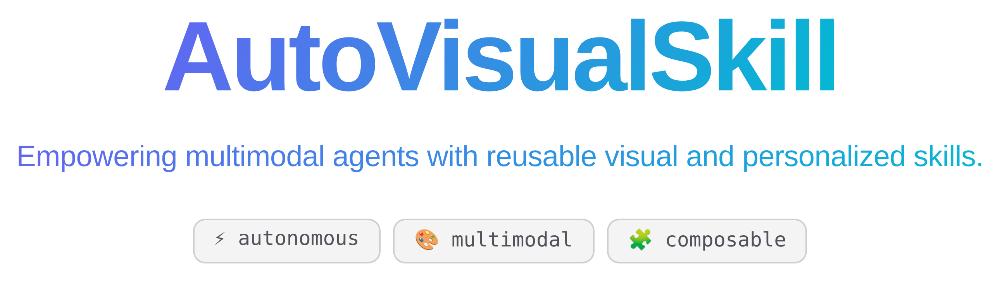

<p><strong>Empowering multimodal agents with reusable visual and personalized skills.</strong></p>

</div>

**AutoVisualSkill** augments multimodal agent skill libraries with reusable **Visual Agent Skill** artifacts. Given text prompts, images, accessible URLs, multimodal chat history, sampled video frames, and user interaction traces, it analyzes the task context, identifies visual and personalization bottlenecks, and authors structured skills that downstream agents can load, inspect, version, and reuse. Each generated skill packages task logic, visual priors, multimodal binding protocols, runtime constraints, provenance, and a machine-readable manifest.

Beyond task-level skillization, AutoVisualSkill can capture user-specific work habits, preferred procedures, decision patterns, visual judgment patterns, and interaction styles, enabling multimodal agents to act with stronger visual grounding, better workflow continuity, and more personalized task execution.

<div align="center">

[](#installation)
[](LICENSE)
[](https://arxiv.org/abs/XXXX.XXXXX)
[](#safety-and-prototype-notes)

[Paper](https://arxiv.org/abs/XXXX.XXXXX) ·
[Quick Start](#quick-start) ·
[Demo](#launch-the-gradio-demo) ·
[Curated Examples](#curated-examples)

</div>
---

## Why Visual Skills?

Agent skills are usually represented as text: rules, tool descriptions, checklists, prompt templates, demonstrations, and executable snippets. Text is effective for describing high-level logic, but many multimodal tasks depend on information that is spatial, perceptual, stylistic, or stateful. Examples include GUI hitboxes, chart readout directions, table-cell intersections, visual scan progress, route state, slide layout, color usage, typography, and region-level design intent.

AutoVisualSkill addresses this limitation by treating these visual conventions as first-class skill components. In text-only skills, these conventions are often omitted, described vaguely, or repeatedly re-inferred at runtime. AutoVisualSkill instead makes them persistent, inspectable, and transferable by combining textual logic with visual priors, runtime visual state, and explicit bindings between instructions and the evidence they rely on.

<p align="center">
  <a href="docs/assets/paper_teaser.pdf">
    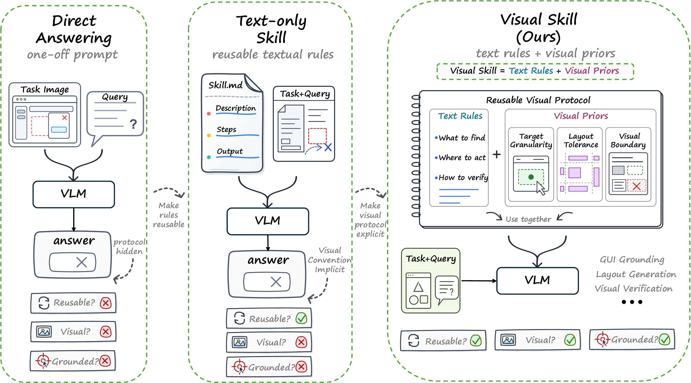
  </a>
  <br />
  <sub><a href="docs/assets/paper_teaser.pdf">Visual Skill at a glance</a></sub>
</p>

> **Key idea.** Text specifies the logic; visual priors preserve the spatial, perceptual, and stylistic protocol. Static priors clarify reusable visual conventions. Dynamic priors externalize intermediate state during execution. Interleaved skills bind textual steps, user preferences, or design rules to the visual evidence they depend on.

## Skill Types

<table>
  <tr>
    <td width="20%" align="center">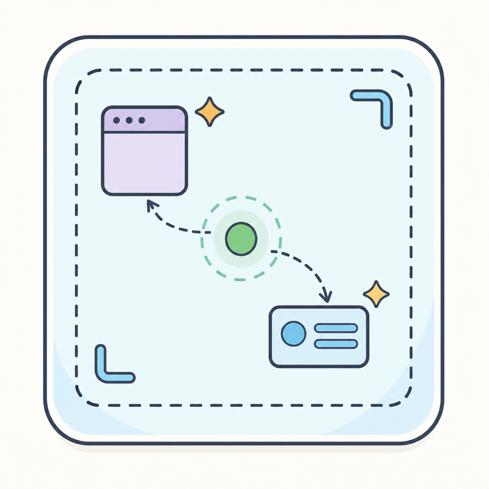</td>
    <td width="30%"><b>Static Visual Skill</b></td>
    <td>A reusable visual reference that resolves protocol ambiguity. Examples include GUI hitboxes, chart projections, table-cell intersections, spatial templates, design references, and annotation conventions.</td>
  </tr>
  <tr>
    <td align="center">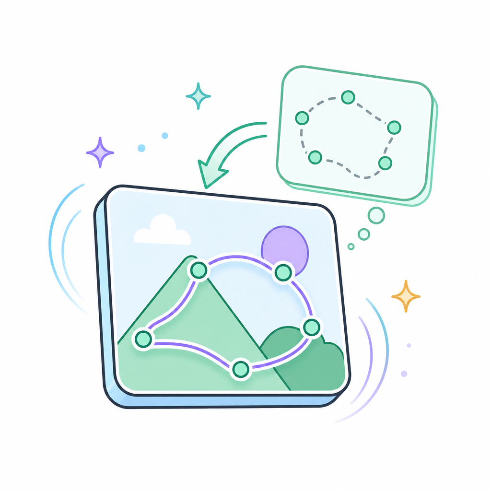</td>
    <td><b>Dynamic Visual Skill</b></td>
    <td>A runtime visual protocol that writes intermediate state back onto the task image. Examples include counted anchors, traced paths, checked candidates, route state, critique regions, layout marks, and progressive edit plans.</td>
  </tr>
  <tr>
    <td align="center">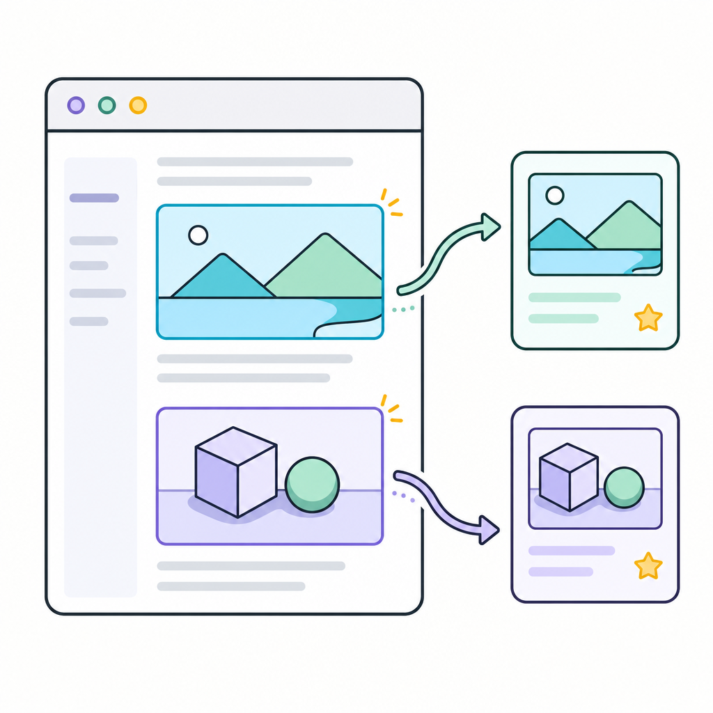</td>
    <td><b>Interleaved Visual Skill</b></td>
    <td>A step-wise skill that aligns text instructions, reasoning steps, style rules, or user preferences with the visual evidence that grounds them, such as screenshots, diagrams, chat attachments, generated panels, design examples, or sampled video frames.</td>
  </tr>
</table>

## What Makes It Useful?

AutoVisualSkill is designed for agent developers who need reusable multimodal behavior rather than one-off prompting. A generated skill can help a downstream agent:

- apply a visual convention consistently across similar tasks;
- preserve intermediate visual state across long-horizon execution;
- reuse layout, style, and region-level design feedback;
- transfer a person's workflow habits or visual judgment patterns into future tasks;
- keep provenance, assets, runtime constraints, and integration metadata together with the instruction file.

## Demo Gallery

AutoVisualSkill turns reusable visual knowledge into task-time context. Static skills make implicit conventions visible, dynamic skills preserve intermediate state across model calls, and interleaved skills keep each step grounded in the exact evidence or design reference it uses.

Recorded task logs are available in [`examples/task_execution_cases/task_execution_results.json`](examples/task_execution_cases/task_execution_results.json).

### Video Demos

The following clips compare the same held-out task with and without the generated visual skill. The key signal is not only whether the final answer changes, but whether the missing visual protocol becomes visible, inspectable, and reusable by the next model call.

**Dense counting: the direct run undercounts `64` objects, while the visual-skill run keeps counted anchors visible and reaches the correct answer `96`.**

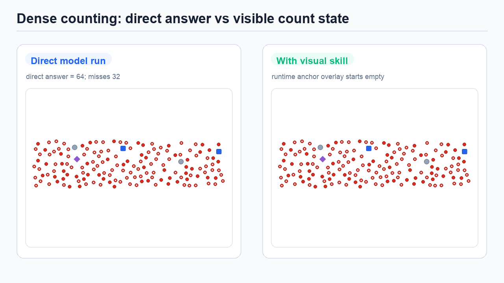

**Slide layout and style refinement: text-only feedback remains broad, while the visual skill marks layout, hierarchy, color, spacing, and region-level redesign intent directly on the slide.**

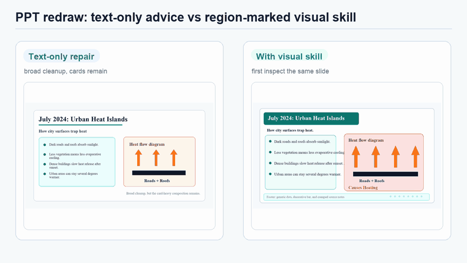

**Odd-one-out search: the direct run selects row 11, column 7, while the visual-skill run visibly tracks checked candidates and selects row 8, column 12.**

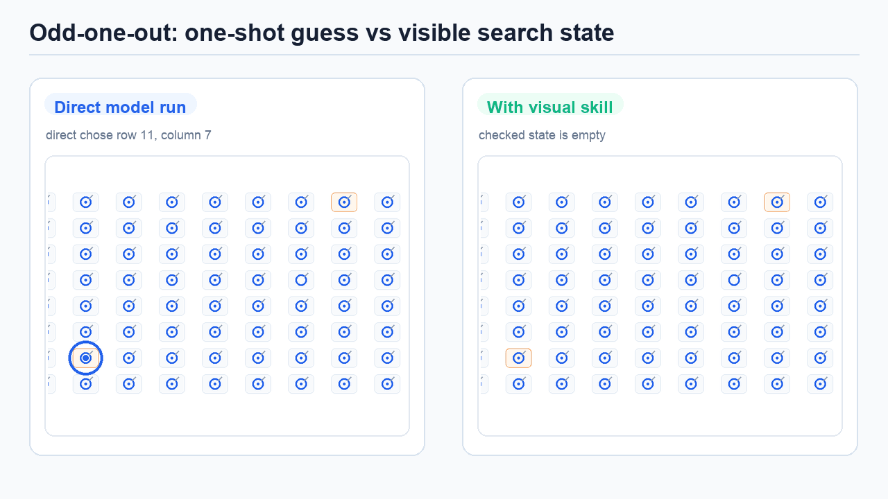

**ARC-AGI route-state planning: both branches start from the same official `ls20` episode. The direct branch loses route state at the split, while the visual-skill branch keeps the visited path, waypoint, and next action visible.**

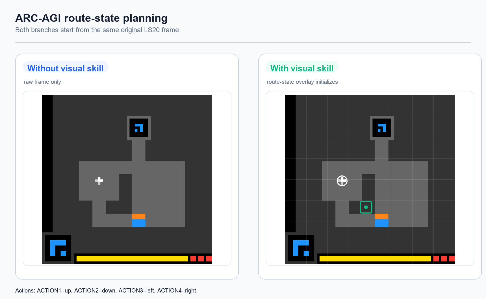

### Clarify Spatial and Perceptual Conventions

Static visual skills make implicit visual conventions explicit. These examples use simple source images and sparse overlays to show the core behavior: identify the true button envelope, intersect the correct table cell, or project a bar value back to the axis.

<table>
  <tr>
    <td width="33%" align="center">
      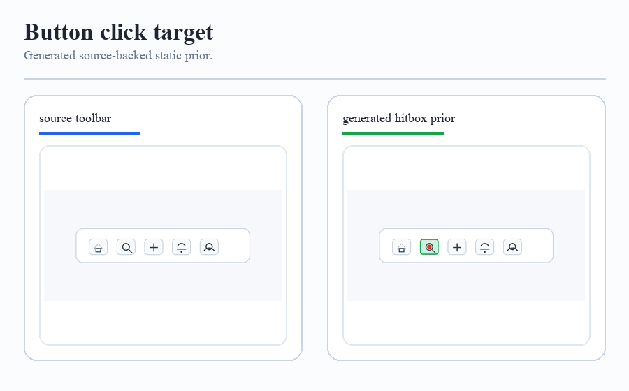
      <br />
      <b>Button click target</b><br />
      The source-backed prior marks the clickable button envelope and click center, rather than only the visible icon pixels.<br />
      <sub><b>Visual bottleneck:</b> a small glyph can be off-center within a larger hitbox. The visual prior exposes the actionable region that text alone would describe only approximately.</sub><br />
      <sub><a href="examples/curated_skills/open_source_homepage_regenerated/03_gui_icon_grounding/skill.md">skill.md</a> · <a href="examples/curated_skills/open_source_homepage_regenerated/03_gui_icon_grounding/SOURCE.md">source</a></sub>
    </td>
    <td width="33%" align="center">
      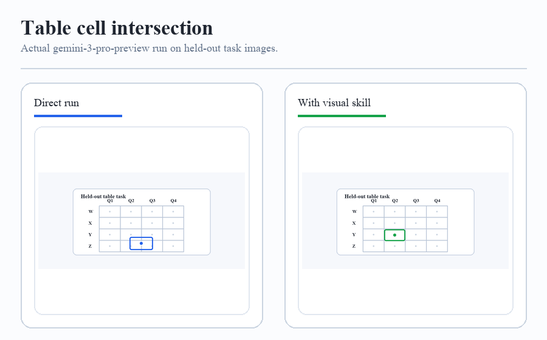
      <br />
      <b>Table cell intersection</b><br />
      The skill marks the target row band, column band, and their intersection.<br />
      <sub><b>Without skill:</b> the model names `Y-Q2` but draws a shifted cell box.<br />
      <b>With skill:</b> the answer is grounded at the row-column intersection.<br />
      <b>Effect:</b> the visual prior turns a symbolic row/column instruction into an explicit spatial readout.</sub><br />
      <sub><a href="examples/curated_skills/open_source_homepage_regenerated/04_table_cell_intersection/skill.md">skill.md</a> · <a href="examples/curated_skills/open_source_homepage_regenerated/04_table_cell_intersection/SOURCE.md">source</a></sub>
    </td>
    <td width="33%" align="center">
      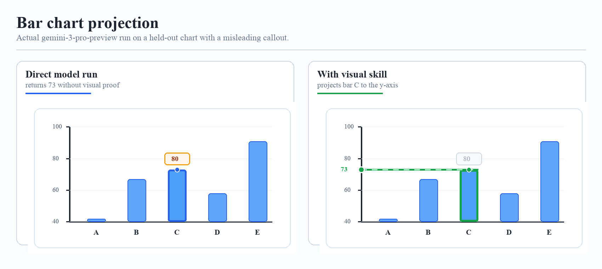
      <br />
      <b>Bar chart projection</b><br />
      The skill marks the selected bar and projects its height back to the y-axis.<br />
      <sub><b>Direct run:</b> the model answers `73`, but the readout remains implicit.<br />
      <b>With skill:</b> the projection from bar C to the y-axis makes the geometric evidence visible.<br />
      <b>Effect:</b> the answer is supported by an explicit visual measurement protocol, not just a numerical estimate.</sub><br />
      <sub><a href="examples/curated_skills/open_source_homepage_regenerated/05_chart_projection/skill.md">skill.md</a> · <a href="examples/curated_skills/open_source_homepage_regenerated/05_chart_projection/SOURCE.md">source</a></sub>
    </td>
  </tr>
</table>

### Externalize Runtime State, Layout, and Visual Style

Dynamic visual skills write intermediate state back onto the task image, allowing the next reasoning step to inspect visible progress instead of relying only on hidden context. This is useful for visual search, counting, route planning, geometry, and artifact editing.

For slide and document editing, dynamic visual skills go beyond content-level feedback. They can expose layout structure, reading order, typography, color usage, spacing, alignment, emphasis, and style consistency as visible design state. A text-only critique may say “make the slide cleaner” or “improve the hierarchy,” but it cannot precisely show which region is visually overloaded, which alignment is broken, which color relationship should be preserved, or how the redesigned layout should inherit the original intent.

A visual skill makes these design decisions inspectable by marking the artifact directly and binding each visual region to a concrete edit.

<table>
  <tr>
    <td align="center">
      
    </td>
  </tr>
  <tr>
    <td align="left">
      <b>Region-grounded slide design refinement</b><br /><br />
      This example applies an AutoVisualSkill-generated slide design skill to a public NASA HEAT teaching slide. The key intermediate artifact is the region-level visual critique overlay: it marks not only what content should be revised, but also how the layout, visual hierarchy, typography, color usage, spacing, alignment, and style consistency should change.<br /><br />
      <sub><b>Runtime visual state:</b> title hierarchy, reading order, diagram grouping, arrow style, color emphasis, cluttered regions, and footer noise are marked directly on the slide.<br />
      <b>Why it matters:</b> slide quality is highly visual. A text-only suggestion can describe that a slide is “too crowded” or “needs stronger hierarchy,” but it cannot encode the spatial layout, style references, color relationships, or region-level redesign intent with sufficient precision. The visual skill turns these design cues into an inspectable region-to-action map that a downstream slide agent can follow.</sub><br /><br />
      <sub>
        <a href="examples/curated_skills/open_source_homepage_regenerated/13_presentation_style_redraw/skill.md">skill.md</a>
        ·
        <a href="examples/curated_skills/open_source_homepage_regenerated/13_presentation_style_redraw/manifest.json">manifest.json</a>
        ·
        <a href="examples/curated_skills/open_source_homepage_regenerated/13_presentation_style_redraw/SOURCE.md">source</a>
      </sub>
    </td>
  </tr>
</table>

<table>
  <tr>
    <td width="50%" align="center">
      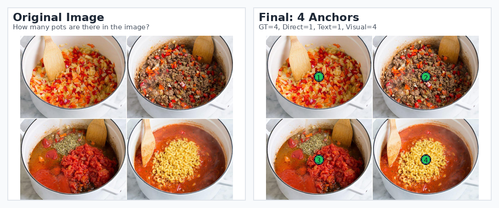
      <br />
      <b>Dense counting</b><br />
      The runtime marks counted objects directly on the task image, turning counting memory into visible state.<br />
      <sub><b>Runtime state:</b> anchors make checked objects inspectable for follow-up model calls, helping the agent avoid omissions and duplicate counts.</sub><br />
      <sub><a href="examples/curated_skills/open_source_homepage_regenerated/02_dense_counting/skill.md">skill.md</a></sub>
    </td>
    <td width="50%" align="center">
      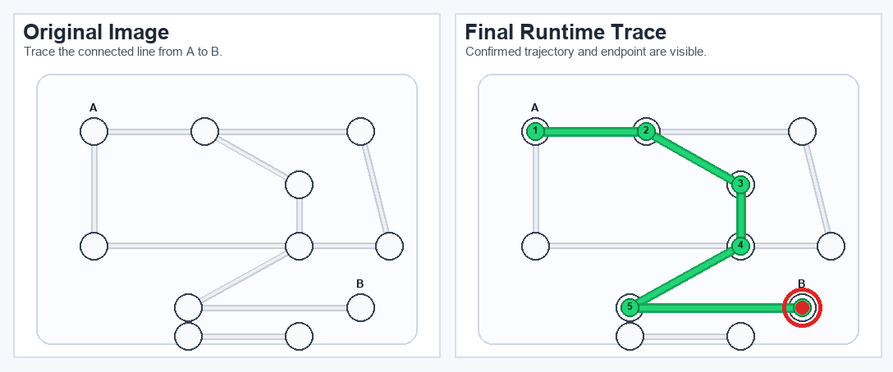
      <br />
      <b>Line tracing</b><br />
      Each step draws the current trajectory so the next call can continue from visible progress.<br />
      <sub><b>Runtime state:</b> the route, current endpoint, and already-traced path are written back onto the graph, reducing drift across steps.</sub><br />
      <sub><a href="examples/curated_skills/open_source_homepage_regenerated/06_connect_lines/skill.md">skill.md</a></sub>
    </td>
  </tr>
  <tr>
    <td width="50%" align="center">
      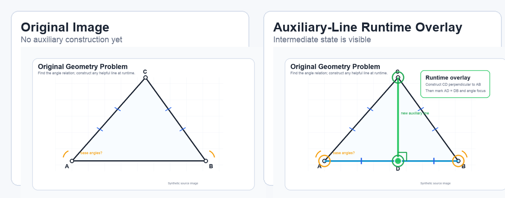
      <br />
      <b>Geometry auxiliary lines</b><br />
      The skill draws constructions, equality marks, and angle focus regions back onto the diagram.<br />
      <sub><b>Runtime state:</b> auxiliary lines and relation marks become reusable diagram state for subsequent proof steps.</sub><br />
      <sub><a href="examples/curated_skills/open_source_homepage_regenerated/10_geometry_auxiliary_lines/skill.md">skill.md</a></sub>
    </td>
    <td width="50%" align="center">
      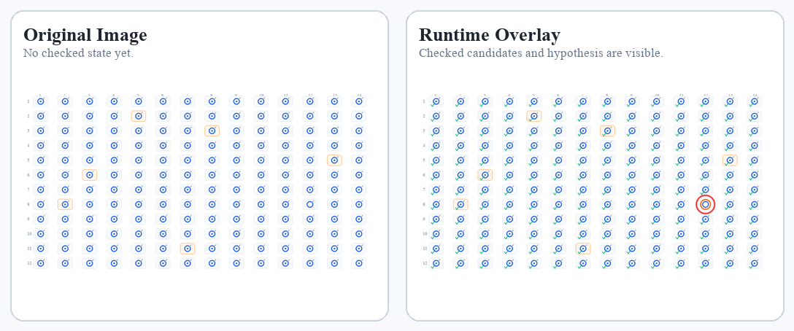
      <br />
      <b>Odd-one-out visual search</b><br />
      The skill marks checked candidates and the current odd-item hypothesis so the search process does not repeat itself.<br />
      <sub><b>Runtime state:</b> checked candidates and current hypotheses make the search path visible, allowing the agent to distinguish new evidence from already-inspected regions.</sub><br />
      <sub><a href="examples/curated_skills/open_source_homepage_regenerated/07_find_different/skill.md">skill.md</a></sub>
    </td>
  </tr>
</table>

<table>
  <tr>
    <td width="50%" align="center">
      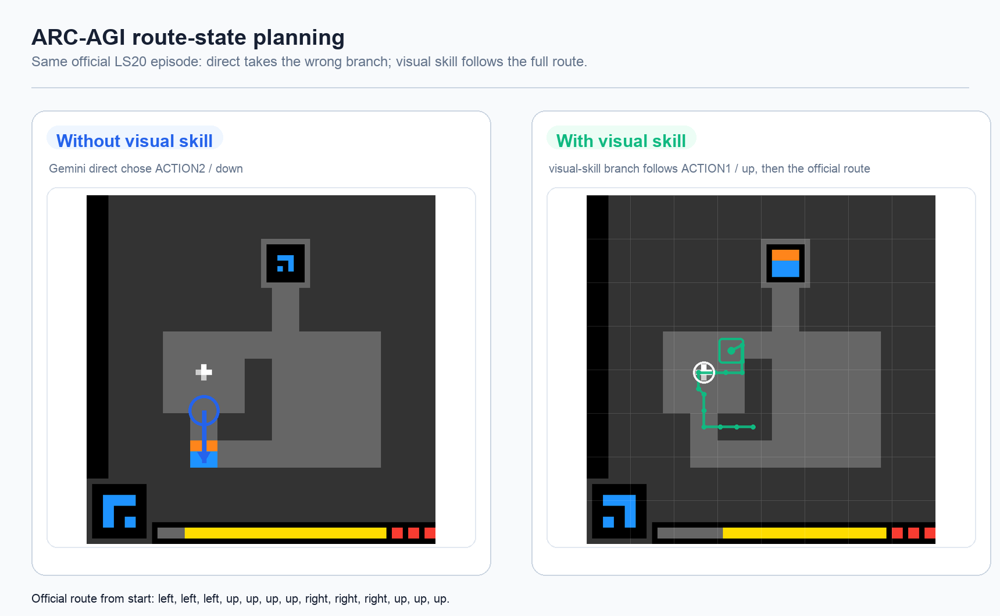
    </td>
    <td width="50%" valign="middle">
      <b>ARC-AGI route-state planning</b><br />
      <sub><b>Input:</b> a real ARC-AGI-3 <code>ls20</code> game frame rendered with the official toolkit.</sub><br />
      <sub><b>Visual skill:</b> keep the current object, visited route, next waypoint, and local plan visible on the returned frame.</sub><br />
      <sub><b>Comparison:</b> after a shared prefix, direct Gemini chooses <code>ACTION2</code> / down and goes off-route; with the route-state overlay, it chooses <code>ACTION1</code> / up and continues along the official route.</sub><br />
      <sub><b>Why it matters:</b> interactive visual agents need persistent state across actions. A text summary can describe the route, but a visual overlay preserves the spatial relation among the current position, visited path, obstacle structure, and next waypoint.</sub><br />
      <sub><a href="examples/curated_skills/open_source_homepage_regenerated/12_arc_agi_route_planning/skill.md">skill.md</a> · <a href="examples/curated_skills/open_source_homepage_regenerated/12_arc_agi_route_planning/SOURCE.md">source</a></sub>
    </td>
  </tr>
</table>

### Bind Steps to Visual Evidence and Personal Examples

Interleaved visual skills keep reasoning steps close to the visual evidence or visual references they depend on. They are useful when a skill is best represented as an ordered sequence of text steps paired with the visual evidence each step uses. The source may be sampled video frames, documentation screenshots, generated design panels, or multimodal chat evidence from a visual collaborator.

This skill type is especially useful when the reusable knowledge is not just a task procedure, but a grounded style, preference, or work habit. Instead of summarizing a user's behavior as vague text, AutoVisualSkill can preserve the examples, regions, before/after edits, and visual evidence that make the behavior reusable.

Read each row from left to right: source visuals appear on the left, and the generated step-to-evidence binding appears on the right.

<table>
  <tr>
    <td width="58%" align="center">
      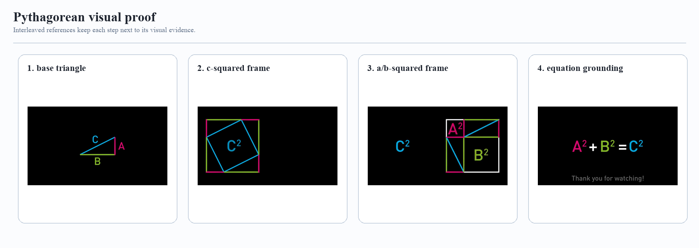
    </td>
    <td width="42%" valign="middle">
      <b>Pythagorean visual proof</b><br />
      <sub><b>Input:</b> sampled video keyframes from a visual proof.</sub><br />
      <sub><b>Visual skill:</b> bind each equation step to the exact frame that shows the relevant triangle side, rearranged square, or area relation.</sub><br />
      <sub><b>Effect:</b> the agent explains the proof with visible evidence beside every claim, rather than relying on a detached symbolic derivation.</sub><br />
      <sub><a href="examples/curated_skills/open_source_homepage_regenerated/09_pythagorean_visual_proof_video/skill.md">skill.md</a> · <a href="examples/curated_skills/open_source_homepage_regenerated/09_pythagorean_visual_proof_video/SOURCE.md">source</a></sub>
    </td>
  </tr>
  <tr>
    <td width="58%" align="center">
      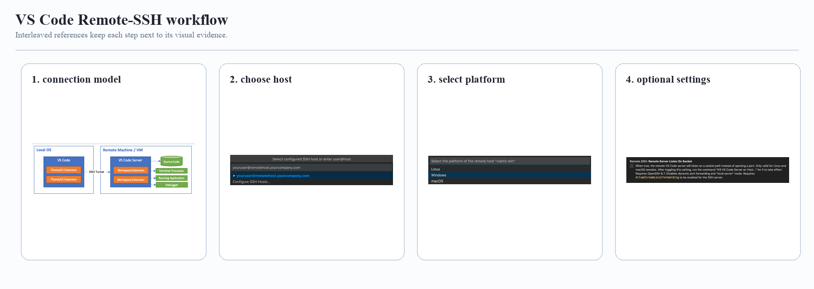
    </td>
    <td width="42%" valign="middle">
      <b>VS Code Remote SSH docs</b><br />
      <sub><b>Input:</b> documentation screenshots and workflow text.</sub><br />
      <sub><b>Visual skill:</b> keep each procedure step next to the screenshot or dialog state that grounds it.</sub><br />
      <sub><b>Effect:</b> the agent can guide the workflow without losing track of which UI state each instruction refers to.</sub><br />
      <sub><a href="examples/curated_skills/open_source_homepage_regenerated/08_vscode_remote_ssh_url/skill.md">skill.md</a></sub>
    </td>
  </tr>
  <tr>
    <td width="58%" align="center">
      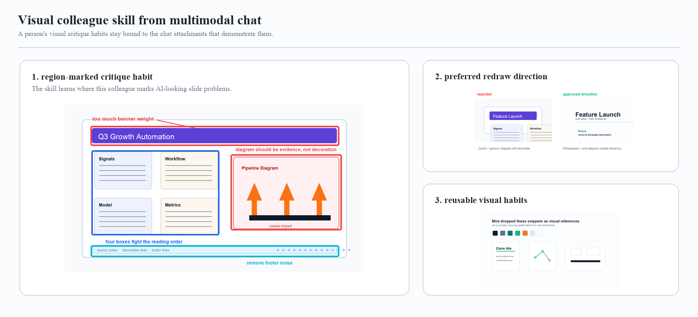
    </td>
    <td width="42%" valign="middle">
      <b>Personalized visual colleague skill</b><br />
      <sub><b>Input:</b> multimodal chat messages with slide critique attachments.</sub><br />
      <sub><b>Visual skill:</b> bind a colleague's style preferences and critique habits to region-marked feedback, before/after edits, and reusable design examples.</sub><br />
      <sub><b>Effect:</b> a slide-making agent can reuse that person's visual judgment pattern, including layout preferences, emphasis style, and recurring critique logic, instead of relying on a vague text-only preference summary.</sub><br />
      <sub><a href="examples/curated_skills/open_source_homepage_regenerated/11_visual_colleague_skill/skill.md">skill.md</a> · <a href="examples/curated_skills/open_source_homepage_regenerated/11_visual_colleague_skill/SOURCE.md">source</a></sub>
    </td>
  </tr>
</table>

## What AutoVisualSkill Generates

Each run produces a packaged skill directory:

```text
skill_output/<run_id>/
├── skill.md                 # human-readable skill
├── assets/                  # optional visual-prior images
├── manifest.json            # routing and integration metadata
├── assets_manifest.json
├── run_config.json
├── web_sources.json
├── provenance.json
├── warnings.json
├── errors.json
└── final_state.json
```

AutoVisualSkill generates reusable skill artifacts for downstream agents. It is not tied to a single runtime: the generated `skill.md`, assets, and manifest can be loaded by a VLM agent, evaluator, benchmark harness, GUI/web agent, slide-editing agent, or custom multimodal workflow.

The key abstraction is that a skill is not only an instruction file. It is a grounded package that can include visual references, runtime state protocols, personalization cues, provenance, and integration metadata.

## System Overview

AutoVisualSkill is organized as an agentic authoring workflow. It parses multimodal context, identifies whether the task requires visual skillization, selects an appropriate visual-prior strategy, and packages the resulting skill for downstream use.

<p align="center">
  <a href="docs/assets/autovisualskill_pipeline.pdf">
    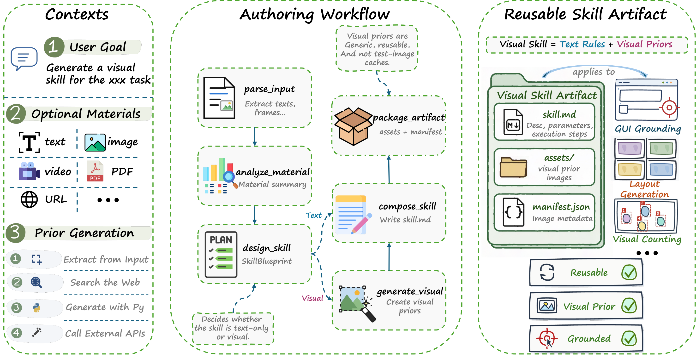
  </a>
</p>

The authoring workflow proceeds through six stages:

1. Parse multimodal materials, including text, images, URLs, chat history, video frames, and user traces.
2. Summarize the task context and identify potential textual, visual, stylistic, or personalization bottlenecks.
3. Decide whether the skill should be static, dynamic, or interleaved.
4. Compose the declarative textual logic and runtime constraints.
5. Generate, attach, or reference visual priors when needed.
6. Package the skill with assets, manifest, provenance, warnings, and runtime metadata.

## Quick Start

### Installation

Use Python 3.10 or newer.

```bash
git clone https://github.com/Little-Fridge/AutoVisualSkill.git
cd AutoVisualSkill

python -m venv .venv
source .venv/bin/activate
pip install -U pip
pip install -r requirements.txt
```

On minimal Ubuntu/Debian images, `python -m venv` may require:

```bash
sudo apt-get update
sudo apt-get install -y python3-venv
```

If you prefer conda:

```bash
conda create -n autovisualskill python=3.10 -y
conda activate autovisualskill
pip install -r requirements.txt
```

### Fastest Offline Check

After installing dependencies, verify the graph and artifact writer without an API key:

```bash
python examples/mock_smoke.py
```

Expected output:

```text
Smoke test passed. Artifact directory: .../skill_output/mock_smoke
```

The smoke test uses the bundled mock backend in `tools/mock_subagent_backend.py`, so it does not contact a model provider or web search service.

## Configure a Model

AutoVisualSkill uses an OpenAI-compatible chat or multimodal model through environment variables.

```bash
cp .env.example .env
export LLM_API_KEY="your_api_key"
export LLM_BASE_URL="https://api.openai.com/v1"
export LLM_MODEL_NAME="gpt-4o"
```

For providers that do not support native structured output, enable JSON-prompt fallback:

```bash
export LLM_FORCE_JSON_PROMPT=1
```

For the OpenAI Responses API style:

```bash
export LLM_API_STYLE=responses
```

Optional web search uses Tavily:

```bash
export TAVILY_API_KEY="your_tavily_key"
```

## Generate Your First Skill

### Python API

```python
from autovisualskill.main import run

result = run(
    user_goal="Generate a visual skill for dense object counting with dynamic point anchors.",
    input_files=[],
    enable_web_research=False,
)

print(result["output_dir"])
```

Or run the included live example:

```bash
python examples/minimal_run.py
```

### CLI

```bash
python -m autovisualskill.main \
  "Generate a GUI grounding visual skill for small icon buttons and nested action icons." \
  --no-web-research
```

Add local text, image, video files, or URLs after the goal:

```bash
python -m autovisualskill.main \
  "Generate a visual skill from these materials." \
  ./input/notes.md \
  ./input/reference.png \
  ./input/tutorial.mp4 \
  --no-web-research
```

Video support in open-source v1 is keyframe-based. AutoVisualSkill samples candidate frames at approximately 1 FPS from local video files, then asks the VLM to select the frames most useful for visual-skill authoring. It does not extract audio, subtitles, transcripts, or full motion semantics. Use `--max-video-frames` to control how many VLM-selected frames are retained from each video.

View all options:

```bash
python -m autovisualskill.main --help
```

Run the CLI fully offline with the mock backend:

```bash
python -m autovisualskill.main \
  "Generate a dense-counting skill with point anchors." \
  --backend subagent \
  --subagent-cmd "python tools/mock_subagent_backend.py" \
  --no-web-research
```

## Launch the Gradio Demo

```bash
python demo_gradio.py
```

Then open the local URL printed by Gradio. The demo can display curated generated artifacts without an API key. Paste an API key into the password field only when you want to run live generation.

## Static, Dynamic, and Interleaved Skills

| Bottleneck | Recommended artifact | Example |
| --- | --- | --- |
| The task contains implicit spatial, perceptual, or stylistic conventions. | Static visual prior | button click target, table cell intersection, bar chart projection, design reference |
| The task requires stepwise visual memory or progressive editing. | Dynamic visual prior | slide layout refinement, dense counting, line tracing, odd-one-out search, geometry construction, route-state planning |
| The task is best represented as ordered logic, style rules, user habits, or workflow preferences grounded in visual evidence. | Interleaved visual skill | visual proof, screenshot sequence, personalized slide critique, visual colleague memory, multimodal chat evidence |

## Use a Generated Skill in an Agent

Generated skills are designed to be consumed by downstream VLM agents. Treat `skill.md` as the instruction document, `manifest.json` as the machine-readable integration contract, and `assets/` as the visual context to attach or render.

For a static visual skill, pass the task image, `skill.md`, and the visual-prior assets to the VLM in the same request:

```text
Use the generated visual skill below.
Skill: skill.md
Visual prior assets: assets/*.png
Task image: user_task.png

Apply the visual convention from the prior to solve the task image.
```

For a dynamic visual skill, use a lightweight runtime loop. The agent emits state updates such as counted anchors, traced segments, layout marks, or critique regions; the runtime renders that state back onto the task image before the next VLM call.

```python
state = {}
current_image = task_image

while not done:
    response = vlm(skill_md, manifest, current_image, state)
    state = response["state_update"]
    current_image = render_overlay(task_image, state)
```

For an interleaved visual skill, pass the ordered frames or screenshots together with `skill.md`, and require each reasoning step to stay grounded in the corresponding visual evidence.

The minimal adapter in `examples/agent_integration_minimal.py` shows how to load a generated skill directory and build a provider-agnostic VLM payload:

```bash
python examples/agent_integration_minimal.py \
  examples/curated_skills/open_source_homepage_regenerated/03_gui_icon_grounding \
  --task-image ./your_task.png
```

## External Image Generation

If a generated blueprint uses the `api` visual-prior strategy, configure an image-generation endpoint:

```bash
export AUTOVISUALSKILL_IMAGE_API_BASE_URL="https://your-provider.example/v1"
export AUTOVISUALSKILL_IMAGE_API_KEY="your_image_api_key"
export AUTOVISUALSKILL_IMAGE_API_MODEL="gpt-image-2"
```

Secrets are read from the environment at runtime. The API key itself is not written to `run_config.json`.

## Curated Examples

Selected generated visual-skill artifacts are stored under `examples/curated_skills/`:

| Kind | Example | Artifact |
| --- | --- | --- |
| Static | Button click target | [skill.md](examples/curated_skills/open_source_homepage_regenerated/03_gui_icon_grounding/skill.md) |
| Static | Table cell intersection | [skill.md](examples/curated_skills/open_source_homepage_regenerated/04_table_cell_intersection/skill.md) |
| Static | Bar chart projection | [skill.md](examples/curated_skills/open_source_homepage_regenerated/05_chart_projection/skill.md) |
| Dynamic | Region-grounded slide design refinement | [skill.md](examples/curated_skills/open_source_homepage_regenerated/13_presentation_style_redraw/skill.md) |
| Dynamic | Dense counting with dynamic anchors | [skill.md](examples/curated_skills/open_source_homepage_regenerated/02_dense_counting/skill.md) |
| Dynamic | Incremental line tracing | [skill.md](examples/curated_skills/open_source_homepage_regenerated/06_connect_lines/skill.md) |
| Dynamic | Odd-one-out visual search | [skill.md](examples/curated_skills/open_source_homepage_regenerated/07_find_different/skill.md) |
| Dynamic | Geometry auxiliary-line construction | [skill.md](examples/curated_skills/open_source_homepage_regenerated/10_geometry_auxiliary_lines/skill.md) |
| Dynamic | ARC-AGI route-state planning | [skill.md](examples/curated_skills/open_source_homepage_regenerated/12_arc_agi_route_planning/skill.md) |
| Interleaved | Creative Commons Pythagorean visual proof from sampled video keyframes | [skill.md](examples/curated_skills/open_source_homepage_regenerated/09_pythagorean_visual_proof_video/skill.md) |
| Interleaved | VS Code Remote-SSH interleaved visual skill | [skill.md](examples/curated_skills/open_source_homepage_regenerated/08_vscode_remote_ssh_url/skill.md) |
| Interleaved | Personalized visual colleague skill from multimodal chat | [skill.md](examples/curated_skills/open_source_homepage_regenerated/11_visual_colleague_skill/skill.md) |

Each example includes a `skill.md`, a `manifest.json`, and optional assets.

## Safety and Prototype Notes

This repository is a research prototype.

- The `draw` visual-prior strategy executes LLM-generated Pillow code with `exec()`. Treat this as unsafe for untrusted models or production use. A production version should replace it with a constrained drawing DSL or a sandboxed subprocess.
- The `overlay` strategy is safer: the model returns a structured mark plan, and AutoVisualSkill renders it with a fixed local renderer.
- Generated artifacts may include model outputs and source metadata. Do not publish `skill_output/` from private runs unless you have reviewed it.
- Do not commit `.env`, API keys, private paths, or benchmark data.

## Citation

If AutoVisualSkill is useful for your work, please cite our paper once available:

```bibtex
@misc{autovisualskill2026,
  title        = {Reusable Agent Skills Should Go Beyond Text: The Case for Visual Skills},
  author       = {Binxiao Xu, Ruichuan An, Bocheng Zou, Hang Hua},
  year         = {2026},
  eprint       = {XXXX.XXXXX},
  archivePrefix= {arXiv},
  primaryClass = {cs.AI}
}
```
