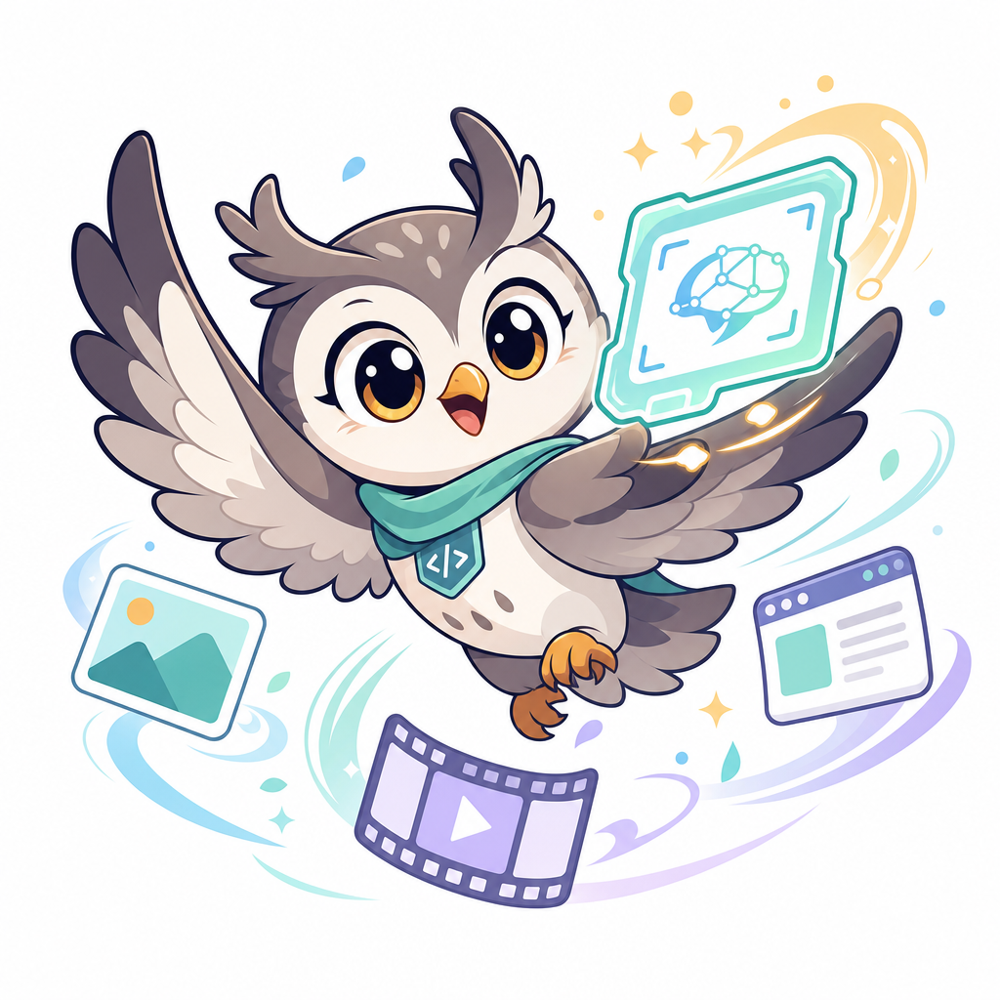

<div align="center">



# AutoVisualSkill

**An agent system for turning multimodal context into reusable visual and personalized skills.**

**AutoVisualSkill** converts text prompts, images, accessible URLs, multimodal
chat history, sampled video frames, and user interaction traces into reusable
**Visual Agent Skill** artifacts. Each skill combines task logic, visual priors,
multimodal binding protocols, runtime constraints, and a machine-readable
manifest. **Beyond task skillization, AutoVisualSkill can capture user-specific
work habits, preferred procedures, decision patterns, and interaction styles so
multimodal agents can act more personally, efficiently, and reliably**.

[](#installation)
[](LICENSE)
[](https://arxiv.org/abs/XXXX.XXXXX)
[](#safety-and-prototype-notes)

[Paper](https://arxiv.org/abs/XXXX.XXXXX) ·
[Quick Start](#quick-start) ·
[Demo](#launch-the-gradio-demo) ·
[Curated Examples](#curated-examples)

</div>

---

## Why Visual Skills?

Most agent protocols are stored as text: rules, tool descriptions, checklists,
and prompt templates. That is useful, but it loses the spatial conventions that
multimodal tasks depend on: GUI hitboxes, chart projection, table intersections,
visual scan state, and perceptual tracking.

AutoVisualSkill treats these conventions as first-class reusable artifacts.

<p align="center">
  <a href="docs/assets/paper_teaser.pdf">
    
  </a>
  <br />
  <sub><a href="docs/assets/paper_teaser.pdf">Visual Skill at a glance</a></sub>
</p>

> **Key idea.** Text explains the logic; visual priors carry the spatial
> protocol. Static priors clarify reusable conventions. Dynamic priors write
> intermediate visual state back onto the task image. Interleaved skills bind
> text steps to the visual evidence or visual references they depend on.

## Skill Types

<table>
  <tr>
    <td width="20%" align="center"></td>
    <td width="30%"><b>Static Visual Skill</b></td>
    <td>A stable visual dictionary for protocol ambiguity, such as GUI hitboxes, chart projection, or table-cell intersection.</td>
  </tr>
  <tr>
    <td align="center"></td>
    <td><b>Dynamic Visual Skill</b></td>
    <td>A runtime protocol that externalizes intermediate state, such as counted anchors, traced lines, or checked candidates.</td>
  </tr>
  <tr>
    <td align="center"></td>
    <td><b>Interleaved Visual Skill</b></td>
    <td>A step-wise skill that binds text instructions, reasoning steps, or style rules to relevant visual evidence, such as screenshots, diagrams, chat attachments, generated panels, or sampled frames.</td>
  </tr>
</table>

## Demo Gallery

AutoVisualSkill turns reusable visual protocols into task-time context: static
skills clarify spatial conventions, dynamic skills write intermediate state
back onto the image, and interleaved skills keep each step beside the evidence
that grounds it. Recorded task logs are stored in
[`examples/task_execution_cases/task_execution_results.json`](examples/task_execution_cases/task_execution_results.json).

### Video Demos

These clips compare the same held-out task with and without the generated
visual skill. The useful signal is the visible intermediate state: counted
anchors, checked candidates, or region-level slide edits that the next model
call can inspect.

**Dense counting: the direct run undercounts `64` vs. the correct `96`; the visual skill keeps every counted object visible.**


**PPT critique-and-redraw: text-only advice stays broad; region-marked critique turns into concrete slide edits.**


**Odd-one-out search: the direct run selects row 11, column 7; the visual skill checks candidates visibly and selects row 8, column 12.**


**ARC-AGI route-state planning: the animation plays the same official `ls20` episode; the direct branch takes the wrong down action at the split, while the visual-skill branch keeps route state visible and follows the full route to the target.**


### Clarify Spatial Conventions

Static visual skills clarify reusable spatial conventions that are easy to
misstate in text alone. These first examples use tiny source images and sparse
overlays so the visual skill is obvious: click the button, intersect the cell,
or project the bar to the axis.

<table>
  <tr>
    <td width="33%" align="center">
      
      <br />
      <b>Button click target</b><br />
      Source-backed prior marks the clickable button envelope and click center, not just the icon ink.<br />
      <sub><b>Visual bottleneck:</b> a small glyph can be off-center inside a larger hitbox; the prior makes the click target visible.</sub><br />
      <sub><a href="examples/curated_skills/open_source_homepage_regenerated/03_gui_icon_grounding/skill.md">skill.md</a> · <a href="examples/curated_skills/open_source_homepage_regenerated/03_gui_icon_grounding/SOURCE.md">source</a></sub>
    </td>
    <td width="33%" align="center">
      
      <br />
      <b>Table cell intersection</b><br />
      Mark the target row band, column band, and their intersection point.<br />
      <sub><b>Without:</b> names `Y-Q2` but draws a shifted cell box.<br />
      <b>With skill:</b> names `Y-Q2` and boxes the row-band/column-band intersection.<br />
      <b>Difference:</b> the held-out table answer is grounded at the correct cell.</sub><br />
      <sub><a href="examples/curated_skills/open_source_homepage_regenerated/04_table_cell_intersection/skill.md">skill.md</a> · <a href="examples/curated_skills/open_source_homepage_regenerated/04_table_cell_intersection/SOURCE.md">source</a></sub>
    </td>
    <td width="33%" align="center">
      
      <br />
      <b>Bar chart projection</b><br />
      Mark the selected bar and project its height straight back to the y-axis.<br />
      <sub><b>Direct run:</b> answers `73`, but the readout remains an implicit estimate.<br />
      <b>With skill:</b> projects bar C to the y-axis and makes the geometric evidence visible.<br />
      <b>Difference:</b> the value is backed by an explicit spatial readout protocol, not only a number.</sub><br />
      <sub><a href="examples/curated_skills/open_source_homepage_regenerated/05_chart_projection/skill.md">skill.md</a> · <a href="examples/curated_skills/open_source_homepage_regenerated/05_chart_projection/SOURCE.md">source</a></sub>
    </td>
  </tr>
</table>

### Externalize Runtime State

Dynamic visual skills write intermediate state back onto the task image, so the
next reasoning step can inspect visible progress instead of relying on hidden
memory. The same loop can guide downstream visual agents: critique the current
visual draft, render the critique as visible state, then use that state to
revise the artifact.

<table>
  <tr>
    <td align="center">
      
    </td>
  </tr>
  <tr>
    <td align="left">
      <b>PPT critique-and-redraw</b><br /><br />
      The preview applies an AutoVisualSkill-generated slide critique skill to a real public NASA HEAT teaching slide. The important middle state is the red/purple/teal critique overlay: each marked region is tied to a local rewrite action before the redraw.<br /><br />
      <sub><b>Runtime visual state:</b> header weight, reading order, default arrows, diagram clutter, and footer noise are marked directly on the slide.<br />
      <b>Why it matters:</b> the redraw follows a visible region-to-action map instead of a generic text-only design suggestion.</sub><br /><br />
      <sub>
        <a href="examples/curated_skills/open_source_homepage_regenerated/13_presentation_style_redraw/skill.md">skill.md</a>
        ·
        <a href="examples/curated_skills/open_source_homepage_regenerated/13_presentation_style_redraw/manifest.json">manifest.json</a>
        ·
        <a href="examples/curated_skills/open_source_homepage_regenerated/13_presentation_style_redraw/SOURCE.md">source</a>
      </sub>
    </td>
  </tr>
</table>

<table>
  <tr>
    <td width="50%" align="center">
      
      <br />
      <b>Dense counting</b><br />
      The runtime marks counted objects on the task image, turning memory into visible state.<br />
      <sub><b>Runtime state:</b> anchors make checked objects inspectable for follow-up calls and denser iterative counts.</sub><br />
      <sub><a href="examples/curated_skills/open_source_homepage_regenerated/02_dense_counting/skill.md">skill.md</a></sub>
    </td>
    <td width="50%" align="center">
      
      <br />
      <b>Line tracing</b><br />
      Each step draws the current trajectory so the next call continues from visible progress.<br />
      <sub><b>Runtime state:</b> the route, current endpoint, and already-traced path are written back onto the graph.</sub><br />
      <sub><a href="examples/curated_skills/open_source_homepage_regenerated/06_connect_lines/skill.md">skill.md</a></sub>
    </td>
  </tr>
  <tr>
    <td width="50%" align="center">
      
      <br />
      <b>Geometry auxiliary lines</b><br />
      Draw constructions, equalities, and angle focus back onto the diagram.<br />
      <sub><b>Runtime state:</b> the auxiliary line and relation marks become reusable diagram state for the next proof step.</sub><br />
      <sub><a href="examples/curated_skills/open_source_homepage_regenerated/10_geometry_auxiliary_lines/skill.md">skill.md</a></sub>
    </td>
    <td width="50%" align="center">
      
      <br />
      <b>Odd-one-out visual search</b><br />
      Mark checked candidates and the current odd-item hypothesis so the search does not repeat itself.<br />
      <sub><b>Runtime state:</b> checked candidates and the current hypothesis make the search path visible instead of implicit.</sub><br />
      <sub><a href="examples/curated_skills/open_source_homepage_regenerated/07_find_different/skill.md">skill.md</a></sub>
    </td>
  </tr>
</table>

<table>
  <tr>
    <td width="50%" align="center">
      
    </td>
    <td width="50%" valign="middle">
      <b>ARC-AGI route-state planning</b><br />
      <sub><b>Input:</b> real ARC-AGI-3 <code>ls20</code> game frame rendered with the official toolkit.</sub><br />
      <sub><b>Visual skill:</b> keep current object, visited route, waypoint, and next local plan visible on the returned frame.</sub><br />
      <sub><b>Comparison:</b> after the shared prefix, direct Gemini chose <code>ACTION2</code> / down and went off-route; with the route-state overlay it chose <code>ACTION1</code> / up and continued the official route.</sub><br />
      <sub><b>Why it matters:</b> interactive visual agents need visible state across actions, especially when action efficiency and coordinate grounding matter.</sub><br />
      <sub><a href="examples/curated_skills/open_source_homepage_regenerated/12_arc_agi_route_planning/skill.md">skill.md</a> · <a href="examples/curated_skills/open_source_homepage_regenerated/12_arc_agi_route_planning/SOURCE.md">source</a></sub>
    </td>
  </tr>
</table>

### Bind Steps to Visual Evidence

Interleaved visual skills keep reasoning steps next to the visual evidence or
visual references they depend on, whether the source is sampled video frames,
documentation screenshots, or multimodal chat evidence from a visual colleague.
Read each row left-to-right: source visuals on the left, the generated
step-to-evidence binding on the right.

<table>
  <tr>
    <td width="58%" align="center">
      
    </td>
    <td width="42%" valign="middle">
      <b>Pythagorean visual proof</b><br />
      <sub><b>Input:</b> sampled video keyframes from a visual proof.</sub><br />
      <sub><b>Visual skill:</b> bind each equation step to the exact frame that shows the triangle side, rearranged square, or final area relation.</sub><br />
      <sub><b>Effect:</b> the agent explains the proof with visible evidence beside every claim.</sub><br />
      <sub><a href="examples/curated_skills/open_source_homepage_regenerated/09_pythagorean_visual_proof_video/skill.md">skill.md</a> · <a href="examples/curated_skills/open_source_homepage_regenerated/09_pythagorean_visual_proof_video/SOURCE.md">source</a></sub>
    </td>
  </tr>
  <tr>
    <td width="58%" align="center">
      
    </td>
    <td width="42%" valign="middle">
      <b>VS Code Remote SSH docs</b><br />
      <sub><b>Input:</b> documentation screenshots and workflow text.</sub><br />
      <sub><b>Visual skill:</b> keep each procedure step next to the screenshot or dialog state that grounds it.</sub><br />
      <sub><b>Effect:</b> the agent can guide the workflow without losing which UI state the instruction refers to.</sub><br />
      <sub><a href="examples/curated_skills/open_source_homepage_regenerated/08_vscode_remote_ssh_url/skill.md">skill.md</a></sub>
    </td>
  </tr>
  <tr>
    <td width="58%" align="center">
      
    </td>
    <td width="42%" valign="middle">
      <b>Visual colleague skill</b><br />
      <sub><b>Input:</b> multimodal chat messages with slide critique attachments.</sub><br />
      <sub><b>Visual skill:</b> bind a colleague's style rules to region-marked critique, before/after edits, and reusable design snippets.</sub><br />
      <sub><b>Effect:</b> a slide-making agent can reuse that person's visual critique habit instead of a vague text-only preference summary.</sub><br />
      <sub><a href="examples/curated_skills/open_source_homepage_regenerated/11_visual_colleague_skill/skill.md">skill.md</a> · <a href="examples/curated_skills/open_source_homepage_regenerated/11_visual_colleague_skill/SOURCE.md">source</a></sub>
    </td>
  </tr>
</table>

## What AutoVisualSkill Generates

Each run produces a packaged skill directory:

```text
skill_output/<run_id>/
├── skill.md                 # human-readable skill
├── assets/                  # optional visual-prior images
├── manifest.json            # routing + integration metadata
├── assets_manifest.json
├── run_config.json
├── web_sources.json
├── provenance.json
├── warnings.json
├── errors.json
└── final_state.json
```

AutoVisualSkill is a **visual-skill factory**. It generates artifacts; it does not force a
specific downstream runtime. You can plug the generated `skill.md`, assets, and
manifest into your own VLM agent, evaluator, or benchmark harness.

## System Overview

The authoring workflow parses multimodal context, detects the visual bottleneck,
constructs the right visual prior strategy, and packages the resulting skill.

<p align="center">
  <a href="docs/assets/autovisualskill_pipeline.pdf">
    
  </a>
</p>

AutoVisualSkill follows a graph-based authoring workflow:

1. Parse multimodal materials.
2. Summarize the task context and bottleneck.
3. Decide whether the visual skill should be static, dynamic, or interleaved.
4. Compose declarative textual logic.
5. Generate or attach visual priors when useful.
6. Package the artifact with a manifest and provenance.

## Quick Start

### Installation

Use Python 3.10 or newer.

```bash
git clone https://github.com/Little-Fridge/AutoVisualSkill.git
cd AutoVisualSkill

python -m venv .venv
source .venv/bin/activate
pip install -U pip
pip install -r requirements.txt
```

On minimal Ubuntu/Debian images, `python -m venv` may require:

```bash
sudo apt-get update
sudo apt-get install -y python3-venv
```

If you prefer conda:

```bash
conda create -n autovisualskill python=3.10 -y
conda activate autovisualskill
pip install -r requirements.txt
```

### Fastest Offline Check

After installing dependencies, verify the graph and artifact writer without any
API key:

```bash
python examples/mock_smoke.py
```

Expected output:

```text
Smoke test passed. Artifact directory: .../skill_output/mock_smoke
```

The smoke test uses the bundled mock backend in
`tools/mock_subagent_backend.py`, so it does not contact a model provider or web
search service.

## Configure a Model

AutoVisualSkill uses an OpenAI-compatible chat or multimodal model through environment
variables.

```bash
cp .env.example .env
export LLM_API_KEY="your_api_key"
export LLM_BASE_URL="https://api.openai.com/v1"
export LLM_MODEL_NAME="gpt-4o"
```

For providers that do not support native structured output, enable JSON-prompt
fallback:

```bash
export LLM_FORCE_JSON_PROMPT=1
```

For the OpenAI Responses API style:

```bash
export LLM_API_STYLE=responses
```

Optional web search uses Tavily:

```bash
export TAVILY_API_KEY="your_tavily_key"
```

## Generate Your First Skill

### Python API

```python
from autovisualskill.main import run

result = run(
    user_goal="Generate a visual skill for dense object counting with dynamic point anchors.",
    input_files=[],
    enable_web_research=False,
)

print(result["output_dir"])
```

Or run the included live example:

```bash
python examples/minimal_run.py
```

### CLI

```bash
python -m autovisualskill.main \
  "Generate a GUI grounding visual skill for small icon buttons and nested action icons." \
  --no-web-research
```

Add local text/image/video files or URLs after the goal:

```bash
python -m autovisualskill.main \
  "Generate a visual skill from these materials." \
  ./input/notes.md \
  ./input/reference.png \
  ./input/tutorial.mp4 \
  --no-web-research
```

Video support in open-source v1 is keyframe-based: AutoVisualSkill samples
candidate frames at approximately 1 FPS from local video files, then asks the
VLM to select the frames most useful for visual-skill authoring. It does not
extract audio, subtitles, transcripts, or full motion semantics. Use
`--max-video-frames` to control how many VLM-selected frames are retained from
each video.

View all options:

```bash
python -m autovisualskill.main --help
```

Run the CLI fully offline with the mock backend:

```bash
python -m autovisualskill.main \
  "Generate a dense-counting skill with point anchors." \
  --backend subagent \
  --subagent-cmd "python tools/mock_subagent_backend.py" \
  --no-web-research
```

## Launch the Gradio Demo

```bash
python demo_gradio.py
```

Then open the local URL printed by Gradio. The demo shows curated generated
artifacts even without an API key. Paste an API key into the password field only
when you want to run live generation.

## Static, Dynamic, and Interleaved Skills

| Bottleneck | Recommended artifact | Example |
| --- | --- | --- |
| The task has implicit spatial conventions. | Static visual prior | button click target, table cell intersection, bar chart projection |
| The task needs stepwise visual memory. | Dynamic visual prior | slide critique-and-redraw, Dense counting, line tracing, odd-one-out search, geometry construction |
| The task is best represented as ordered text or reusable style/workflow rules bound to visual evidence. | Interleaved visual skill | visual proof, screenshot sequence, visual colleague memory, multimodal chat evidence |

## Use a Generated Skill in an Agent

Generated skills are meant to be consumed by a downstream VLM agent. Treat
`skill.md` as the instruction document, `manifest.json` as the machine-readable
integration contract, and `assets/` as the visual context to attach or render.

For a static visual skill, pass the task image, `skill.md`, and the visual-prior
assets to the VLM in the same request:

```text
Use the generated visual skill below.
Skill: skill.md
Visual prior assets: assets/*.png
Task image: user_task.png

Apply the visual convention from the prior to solve the task image.
```

For a dynamic visual skill, keep a small runtime loop. The agent emits state
updates such as counted anchors, traced segments, or critique regions; your
runtime renders that state back onto the task image before the next VLM call.

```python
state = {}
current_image = task_image

while not done:
    response = vlm(skill_md, manifest, current_image, state)
    state = response["state_update"]
    current_image = render_overlay(task_image, state)
```

For an interleaved visual skill, pass the ordered frames/screenshots together
with `skill.md`, and require each reasoning step to stay next to the visual
evidence it depends on.

The minimal adapter in `examples/agent_integration_minimal.py` shows how to
load a generated skill directory and build a provider-agnostic VLM payload:

```bash
python examples/agent_integration_minimal.py \
  examples/curated_skills/open_source_homepage_regenerated/03_gui_icon_grounding \
  --task-image ./your_task.png
```

## External Image Generation

If a generated blueprint chooses visual-prior strategy `api`, configure an image
generation endpoint:

```bash
export AUTOVISUALSKILL_IMAGE_API_BASE_URL="https://your-provider.example/v1"
export AUTOVISUALSKILL_IMAGE_API_KEY="your_image_api_key"
export AUTOVISUALSKILL_IMAGE_API_MODEL="gpt-image-2"
```

Secrets are read from the environment at runtime. The API key itself is not
written to `run_config.json`.

## Curated Examples

Selected generated visual-skill artifacts are stored under
`examples/curated_skills/`:

| Kind | Example | Artifact |
| --- | --- | --- |
| Static | Button click target | [skill.md](examples/curated_skills/open_source_homepage_regenerated/03_gui_icon_grounding/skill.md) |
| Static | Table cell intersection | [skill.md](examples/curated_skills/open_source_homepage_regenerated/04_table_cell_intersection/skill.md) |
| Static | Bar chart projection | [skill.md](examples/curated_skills/open_source_homepage_regenerated/05_chart_projection/skill.md) |
| Dynamic | Presentation design critique-and-redraw | [skill.md](examples/curated_skills/open_source_homepage_regenerated/13_presentation_style_redraw/skill.md) |
| Dynamic | Dense counting with dynamic anchors | [skill.md](examples/curated_skills/open_source_homepage_regenerated/02_dense_counting/skill.md) |
| Dynamic | Incremental line tracing | [skill.md](examples/curated_skills/open_source_homepage_regenerated/06_connect_lines/skill.md) |
| Dynamic | Odd-one-out visual search | [skill.md](examples/curated_skills/open_source_homepage_regenerated/07_find_different/skill.md) |
| Dynamic | Geometry auxiliary-line construction | [skill.md](examples/curated_skills/open_source_homepage_regenerated/10_geometry_auxiliary_lines/skill.md) |
| Dynamic | ARC-AGI route-state planning | [skill.md](examples/curated_skills/open_source_homepage_regenerated/12_arc_agi_route_planning/skill.md) |
| Interleaved | Creative Commons Pythagorean visual proof from sampled video keyframes | [skill.md](examples/curated_skills/open_source_homepage_regenerated/09_pythagorean_visual_proof_video/skill.md) |
| Interleaved | VS Code Remote-SSH interleaved visual skill | [skill.md](examples/curated_skills/open_source_homepage_regenerated/08_vscode_remote_ssh_url/skill.md) |
| Interleaved | Visual colleague slide critique from multimodal chat | [skill.md](examples/curated_skills/open_source_homepage_regenerated/11_visual_colleague_skill/skill.md) |

Each example includes a `skill.md`, a `manifest.json`, and optional assets.

## Safety and Prototype Notes

This repository is a research prototype.

- The `draw` visual-prior strategy executes LLM-generated Pillow code with
  `exec()`. Treat this as unsafe for untrusted models or production use. A
  production version should replace this with a constrained drawing DSL or a
  sandboxed subprocess. The `overlay` strategy is safer: the model returns a
  structured mark plan, and AutoVisualSkill renders it with a fixed local
  renderer.
- Generated artifacts can include model outputs and source metadata. Do not
  publish `skill_output/` from private runs unless you have reviewed it.
- Do not commit `.env`, API keys, private paths, or benchmark data.

## Citation

If AutoVisualSkill is useful for your work, please cite our paper once available:

```bibtex
@misc{autovisualskill2026,
  title        = {Reusable Agent Skills Should Go Beyond Text: The Case for Visual Skills},
  author       = {Binxiao Xu, Ruichuan An, Bocheng Zou, Hang Hua},
  year         = {2026},
  eprint       = {XXXX.XXXXX},
  archivePrefix= {arXiv},
  primaryClass = {cs.AI}
}
```
