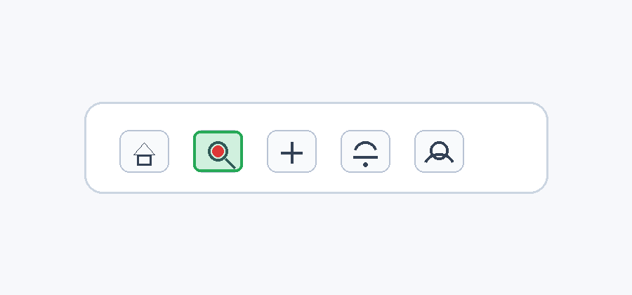

# Click Search Button Toolbar

## Description
A visual skill to locate and click the search button (magnifying glass icon) within a simple UI toolbar, defining the clickable envelope and optimal click center.

## Declarative Textual Logic
- The search button is identified by a magnifying glass icon.
- The clickable area (hitbox) extends beyond the icon's strokes to the visible or implicit rounded square boundary surrounding it.
- The optimal click point is the geometric center of the hitbox, not necessarily the center of the magnifying glass's circular lens.

## Visual Priors


This reference image demonstrates the exact spatial extent of the clickable hitbox relative to the icon graphic, and the optimal center point for a click action, which prose cannot convey precisely.

**Visual Encodings:**
- **Green rectangle**: Represents the clickable hitbox envelope.
- **Red dot**: Represents the optimal click center.

## Multimodal Binding Protocol
- **Text-to-Visual Binding**: The "search button" in the text rules refers to the icon enclosed by the green rectangle in the reference overlay. The "click center" refers to the red dot.
- **Task Input**: The task input is the `target_image` parameter.
- **Coordinate System**: Use `normalized_xy` coordinates (values between 0.0 and 1.0) for the output.
- **Anti-Leakage Rules**: Do not output the exact coordinates from the reference image. You must calculate the coordinates dynamically for the specific `target_image` provided at runtime.

## Runtime Protocol
This skill operates in a **single-turn** mode.

## Parameters
| Name | Type | Description |
| :--- | :--- | :--- |
| `target_image` | image | The UI screenshot containing the toolbar. |

## Execution Steps
1. Receive the target UI image.
2. Scan the image to locate the horizontal toolbar containing a row of icons.
3. Identify the search button by finding the magnifying glass icon.
4. Determine the clickable envelope (hitbox) around the magnifying glass icon, using the green rectangle in the visual prior as a guide for padding and boundaries.
5. Calculate the center point of this hitbox (corresponding to the red dot in the visual prior).
6. Return the `[x, y]` coordinates of this center point.

## Usage Constraints
- The target image must contain a visible toolbar with a magnifying glass icon.
- Assumes a standard horizontal toolbar layout.
- Do not treat the visual prior as the task instance; it is strictly a spatial reference for the hitbox and click center.

## Output Format
Output a JSON object containing the normalized coordinates of the click point:
```json
{
  "click_point": [x, y]
}
```