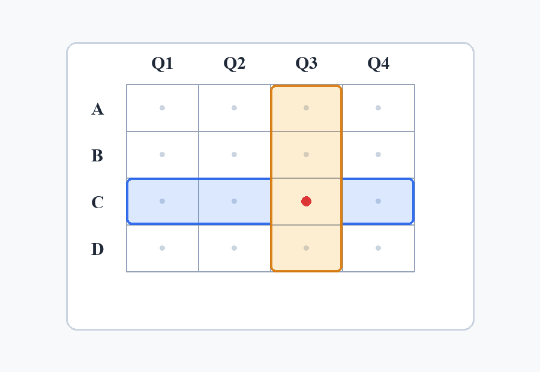

# Table Cell Intersection Locator

## Description
Locates a specific cell in a grid or table image by finding the intersection of
a target row and a target column.

## Declarative Textual Logic
- A table cell is uniquely identified by the intersection of its row and column.
- The target row forms a horizontal band across the table.
- The target column forms a vertical band down the table.
- The target cell is the exact region where the horizontal row band and vertical column band overlap.

## Visual Priors



**Spatial Encodings:**
- **Horizontal semi-transparent band:** Represents the spatial extent of the target row across the table.
- **Vertical semi-transparent band:** Represents the spatial extent of the target column down the table.
- **Solid dot:** Marks the exact center of the intersecting target cell where the two bands overlap.

*(Note: The prior demonstrates locating Row C and Column Q3 as an example. Do not assume these are the targets for actual tasks.)*

## Multimodal Binding Protocol
- **Image Roles:** The provided image acts as a reference overlay demonstrating the intersection concept.
- **Coordinate System:** Relative to table boundaries.
- **Text-to-Visual Binding:**
  - The horizontal band corresponds to the row specified in the task.
  - The vertical band corresponds to the column specified in the task.
  - The intersection dot represents the final output location of the target cell.
- **Task Binding Rules:**
  - Identify the row label matching the target row.
  - Identify the column label matching the target column.
  - Trace the row horizontally and the column vertically to their intersection.
- **Anti-Leakage Rules:** Do not hardcode 'C' or 'Q3' in the execution steps; use generic `target_row` and `target_column` parameters. The prior is strictly a conceptual demonstration.

## Runtime Protocol
- **Mode:** Single-turn

## Parameters

| Parameter Name | Type | Description |
|---|---|---|
| `table_image` | image | The table, calendar, or grid screenshot to inspect. |
| `target_row` | string | The label of the row to locate. |
| `target_column` | string | The label of the column to locate. |

## Execution Steps
1. Scan `table_image` to find the row label matching `target_row`.
2. Mentally project a horizontal band across the table from this row label.
3. Scan the top or bottom margins of `table_image` to find the label matching `target_column`.
4. Mentally project a vertical band down the table from this column label.
5. Locate the single cell where the horizontal and vertical bands intersect.
6. Extract the contents, state, or coordinates of this intersection cell.

## Usage Constraints
- The table must have clear row and column labels.
- The table must be a regular grid without complex merged cells spanning the target intersection.

## Output Format
```json
{
  "target_cell_bbox": [x1, y1, x2, y2],
  "target_cell_center": [x, y],
  "target_cell_content": "<string>",
  "row": "<string>",
  "column": "<string>"
}
```
