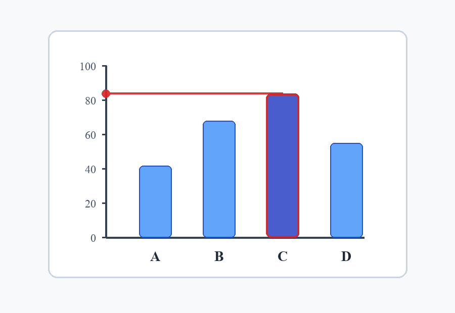

# Read Bar Chart Value

## Description
A visual skill for accurately reading the value of a specific bar in a bar chart by projecting its height horizontally to the y-axis.

## Declarative Textual Logic
- Identify the target category label on the x-axis.
- Locate the corresponding bar directly above the target label.
- Identify the top horizontal edge of the target bar.
- Project a strictly horizontal line from the top edge of the bar to the y-axis.
- Identify the y-axis tick marks immediately above and below the intersection point.
- Interpolate the numerical value based on the intersection's proportional distance between the two tick marks.
- Ignore floating numeric callouts, nearby annotations, or decorative labels unless
  the task explicitly asks for annotation text; the value must come from the
  projected axis readout.

## Visual Priors



**Spatial Encodings and Semantics:**
- **Colored outline**: Indicates the target bar being measured (e.g., bar C).
- **Colored dashed line**: Represents the strictly horizontal projection path from the top-center of the target bar to the y-axis.
- **Colored dot**: Marks the exact intersection point on the y-axis where the value should be read and interpolated.

## Multimodal Binding Protocol
- **Task Input**: The `image` parameter represents the source chart to be analyzed.
- **Prior Role**: The `projection_overlay_prior` image serves as a geometric guide demonstrating the horizontal projection technique.
- **Coordinate System**: Relative to the chart's x and y axes.
- **Text-to-Visual Binding**:
  - The "target bar" in the text rules corresponds to the highlighted bar in the prior.
  - The "horizontal projection" corresponds to the dashed line.
  - The "intersection point" corresponds to the dot on the y-axis.
- **Task Binding Rules**: Apply the projection technique shown in the prior to the specific bar requested in the task instance.
- **Anti-Leakage Rules**: Do not hardcode or copy the value of bar C from the prior as the answer for future tasks. The prior is a generic geometric guide; always read the value from the task's specific chart and requested category.
  Floating labels in a new chart are not axis evidence unless the task asks to
  transcribe those labels.

## Runtime Protocol
This skill operates in a **single-turn** mode.

## Parameters

| Name | Type | Description |
|---|---|---|
| `target_category` | string | The category label of the bar to read (e.g., 'C'). |
| `image` | image | The bar chart image to be analyzed. |

## Execution Steps
1. Locate the x-axis and find the label matching the `target_category`.
2. Identify the bar directly above this label.
3. Find the top horizontal edge of this bar.
4. Trace a horizontal line from this top edge to the left until it hits the y-axis.
5. Identify the two closest y-axis tick marks (immediately above and below the intersection).
6. Estimate the value based on the intersection's proportional distance between these tick marks.
7. Reject floating annotation text if it conflicts with the geometric axis readout.
8. Return the estimated value.

## Usage Constraints
- Assumes the chart has a linear y-axis.
- Assumes the chart is oriented vertically (bars grow upwards from the x-axis).
- Do not treat the prior image as the task instance.

## Output Format
Output a JSON object containing the target category and the estimated numerical value:
```json
{
  "target_category": "<category>",
  "estimated_value": <float>
}
```
