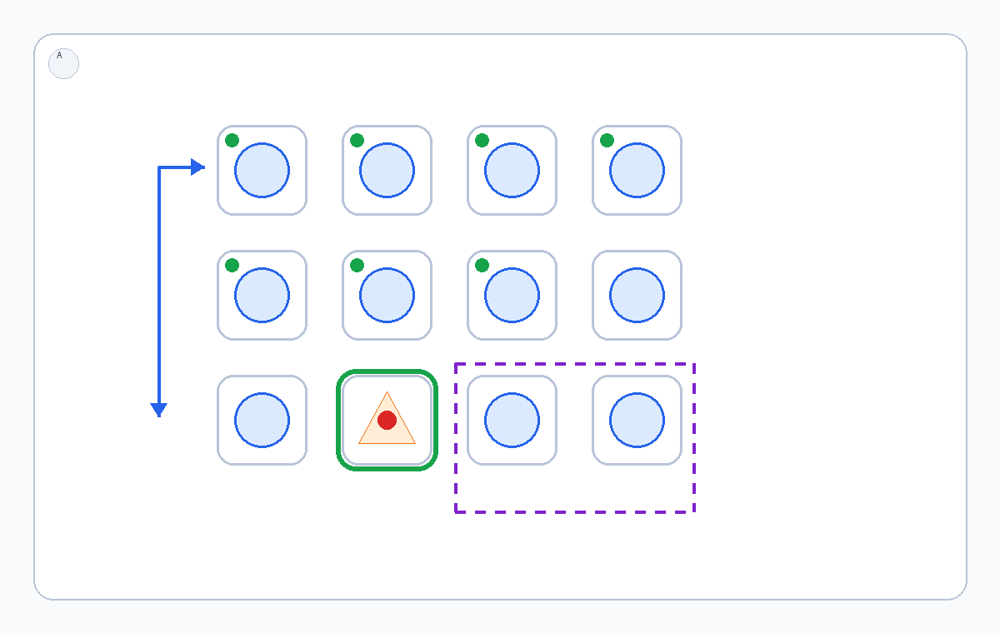

# Visual Skill: Incremental Visual Difference Search

## Description
Find the odd item among repeated candidates by marking checked candidates and comparing one local pair or cluster at a time.

## Declarative Textual Logic
1. Identify the repeated candidate units in the task image.
2. Compare candidates in natural reading order without rechecking already marked units.
3. Render checked candidates back onto the task image as neutral marks.
4. When a candidate differs in shape, orientation, count, or internal structure, mark it as the current hypothesis.
5. Continue until every candidate has either been checked or the difference is visually decisive.

## Dynamic Prior Preview
The image below is a static preview of the overlay semantics, not the runtime
prior itself. At runtime, the dynamic prior is rendered onto the current task
image after each comparison step so checked candidates and the current
hypothesis remain visible.



## Multimodal Binding Protocol
- Green small marks bind to candidates already checked.
- Purple dashed outline binds to the current comparison set.
- Green outline plus red dot binds to the current odd-item hypothesis.
- Repeated blue shapes are normal candidates; the orange shape illustrates a structural difference in the preview only.

## Runtime Protocol
Iterative dynamic prior. The task image is repeatedly updated with checked
markers, the current comparison set, and the current hypothesis until the odd
item is selected.

## Usage Constraints
- The preview image is an abstract protocol reference, not a task instance.
- Do not copy coordinates, object identities, or layouts from the prior.
- Use text for task semantics and use the image for spatial operations.
- Keep any visual annotations tied to the task image rather than hidden in conversation memory.

## Output Format
```json
{"status":"CONTINUE|DONE","checked_points_2d":[[x,y]],"hypothesis_point_2d":[x,y],"answer":"string"}
```
