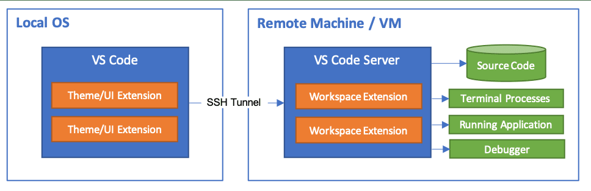
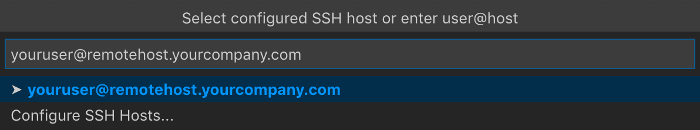
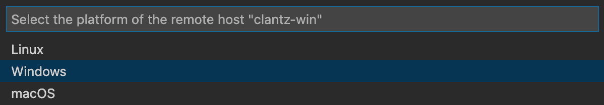
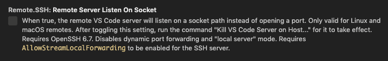

# VS Code Remote-SSH Interleaved Workflow Skill

## Description
An interleaved visual skill for connecting Visual Studio Code to a remote
server over SSH using the Remote-SSH extension. This skill reuses documentation
screenshots and diagrams as step-bound visual references so the user can
recognize the relevant VS Code UI while following the connection flow.

## Declarative Textual Logic
- Use the extracted documentation images only when they directly clarify a step in the Remote-SSH workflow.
- Present the procedure as ordered text instructions with adjacent source images that illustrate the referenced UI or concept.
- Explain prerequisites and actions in text; do not rely on screenshot text as the instruction source.
- Use the architecture diagram to explain what runs locally versus remotely before the user starts connecting.
- Use the host-entry screenshot only for the step where the user selects or enters an SSH destination.
- Use the platform-selection screenshot only for the step where VS Code asks for the remote operating system.
- Use the Remote.SSH settings screenshot only as an optional advanced reference, not as a required step.
- Treat any hostnames, labels, or selections shown in the reused screenshots as examples only.
- If a step is not illustrated by a provided source image, keep that step as text guidance.

## Interleaved Visual References
### Connection model and execution context

This source diagram encodes the separation between the local machine and the remote machine. The left side represents the local VS Code client context. The center connection path represents the SSH tunnel. The right side represents the remote host where the VS Code Server, remote extensions, terminals, workspace access, and other remote resources operate. Orange extension blocks indicate extension placement, and green blocks/resources indicate remote-side execution or assets. Use this image only to explain the local-versus-remote model; do not copy any labels as task inputs.

### Step: choose or enter the SSH host

This source screenshot shows the prompt style used when VS Code asks the user to select a configured SSH host or enter a `user@host` target. The top field is the host-entry area. A listed row indicates a selectable existing host. A secondary option indicates the path for configuring SSH hosts. Use this image to anchor the UI shape of the choice, not to supply a literal hostname.

### Step: select the remote platform if prompted

This source screenshot shows the dialog that asks for the remote host platform. The dialog title identifies the platform-selection task, and the rows represent the available OS choices such as Linux, Windows, and macOS. Any highlighted row is only an example selection state. Use this image only to clarify the dialog appearance and available choice type.

### Optional step: review advanced Remote.SSH settings

This source screenshot shows an example Remote.SSH setting entry in the VS Code Settings UI. The setting title row identifies the setting, and the control area shows where toggles or option values appear. Use this image only as a reference for where advanced Remote.SSH options live in Settings. Do not imply the shown setting is always required.

## Multimodal Binding Protocol
- The task input is the user's goal of connecting VS Code to a remote server over SSH, not the screenshots themselves.
- The screenshots are reusable visual references bound to specific steps in the procedure.
- Use relative image references only: `assets/remote_ssh_connection_model.png`, `assets/ssh_host_entry_prompt.png`, `assets/remote_platform_selection_dialog.png`, and `assets/remote_ssh_setting_example.png`.
- Coordinate system: source-frame identity only. Bind images by role and filename, not by click coordinates or pixel locations.
- Text-to-visual binding rules:
  - When explaining where VS Code components run locally versus remotely, bind to `assets/remote_ssh_connection_model.png`.
  - When instructing the user to choose or type an SSH destination, bind to `assets/ssh_host_entry_prompt.png`.
  - When instructing the user to choose the server OS after a prompt, bind to `assets/remote_platform_selection_dialog.png`.
  - When mentioning optional advanced Remote.SSH configuration, bind to `assets/remote_ssh_setting_example.png`.
- Never copy literal hostnames, machine names, highlighted examples, or other task-instance-like values from the source screenshots into the instructions.
- Do not infer unseen controls or hidden menu states beyond what the screenshots and text logic support.

## Runtime Protocol
Single-turn or stepwise. Use the ordered instructions and source images to guide
the user or downstream agent through the Remote-SSH connection flow. The skill
is not asking the executor to regenerate documentation; it is asking the executor
to help complete the connection task.

State schema:
`{stage:string, current_ui_evidence:string, completed_steps:string[], next_action:string, needs_user_input:boolean}`

Update rule:
- Inspect the current user context or GUI state.
- Identify which Remote-SSH stage the user is in.
- Use the source image bound to that stage to explain or verify the next action.
- Advance one actionable step at a time when operating interactively.

Stop condition:
- Stop when VS Code is connected to the remote host and the user has opened or
  is ready to open a remote folder/workspace, or when the executor needs missing
  information such as the SSH destination, credentials, or remote OS.

## Parameters
| Name | Type | Description |
|---|---|---|
| workflow_goal | string | User-facing goal, such as connecting VS Code to a remote server over SSH. |
| ssh_destination | string | Optional SSH destination such as `user@host`, host alias, or an instruction to let the user provide it. |
| current_ui_state | string | Optional description or screenshot-derived summary of what VS Code currently shows. |
| remote_os | string | Optional remote operating system if already known; otherwise ask the user when VS Code prompts for it. |

## Execution Steps
1. Confirm prerequisites: the user needs SSH access to a reachable remote machine and a local VS Code installation.
2. Install the Remote-SSH extension in VS Code if it is not already installed.
3. Explain the execution model so the user knows that VS Code connects from the local machine to a server-side environment over SSH.

   

4. Start the Remote-SSH connection flow in VS Code and choose the action that lets you connect to a host.
5. When prompted, either select an existing configured SSH host or enter a new destination in the form `user@host`.

   

6. If VS Code asks for the remote platform, choose the operating system that matches the remote machine.

   

7. Allow VS Code to establish the SSH connection and set up its remote components on the target machine.
8. Once connected, open the remote folder or workspace you want to work on.
9. Verify that you are operating in a remote session before editing files, running terminals, or using extensions against the remote environment.
10. If needed, review Remote.SSH settings in VS Code for advanced behavior or troubleshooting-related adjustments.

   

## Usage Constraints
- Reuse only the provided source documentation images that directly support the step being described.
- Do not generate a new abstract visual reference when a relevant source screenshot already exists.
- Do not treat screenshot examples as user-specific answers.
- Do not include private file paths, private credentials, SSH secrets, benchmark answers, or task-instance coordinates.
- Do not annotate the reused images with long prose; keep explanations in Markdown text.
- Do not claim that the optional settings screenshot represents a mandatory step in the main connection flow.
- Do not fabricate unsupported UI paths or controls not grounded in the provided materials.
- Keep the workflow reusable across different servers and environments.

## Output Format
This is an operational interleaved workflow skill, so the normal output is an actionable
connection status rather than a regenerated documentation schema.

For a user-facing assistant, respond with:

```text
Current stage: <where the user is in the Remote-SSH flow>
Next action: <one concrete action to take in VS Code>
Visual reference: <which source image, if any, clarifies this step>
Completion check: <how the user knows the remote connection succeeded>
```

For an automated GUI agent, report compact JSON only after attempting or
checking the step:

```json
{
  "stage": "prerequisites|install_extension|enter_host|select_platform|connecting|remote_opened|optional_settings",
  "next_action": "string",
  "needs_user_input": true,
  "missing_input": "ssh_destination|remote_os|credentials|null",
  "evidence": "string",
  "done": false
}
```

Set `done` to `true` only when VS Code is in a remote window/session and the
user can open or edit files on the remote machine. Never output workflow-step
metadata unless the user explicitly asks to export the skill itself.
