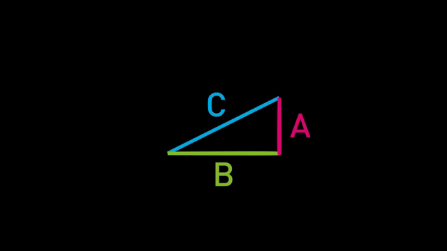
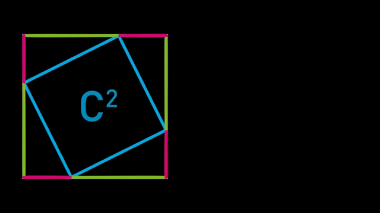
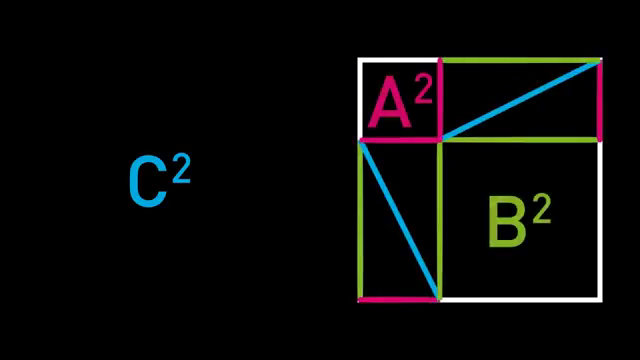
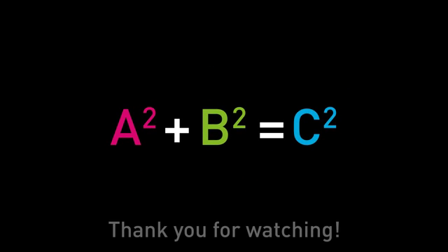

# Pythagorean Visual Proof Reasoning

## Description
An interleaved visual reasoning skill that guides an agent through a geometric proof of the Pythagorean theorem. It uses a sequence of visual transformations to ground the algebraic terms A^2, B^2, and C^2 to their corresponding spatial areas, demonstrating area conservation.

## Declarative Textual Logic
- A right triangle consists of two legs (A and B) and a hypotenuse (C).
- The area of a square formed by the hypotenuse is C^2.
- The areas of squares formed by the legs are A^2 and B^2.
- When four identical copies of the base right triangle are arranged in a square with side length (A+B), the empty space inside represents the area of the remaining squares.
- Arrangement 1: The triangles are placed in the corners, leaving a single tilted square of area C^2 in the center.
- Arrangement 2: The triangles are paired into two A-by-B rectangles, leaving two separate squares of area A^2 and B^2.
- Because the total bounding area (A+B)^2 is identical in both arrangements, and the area of the four triangles is identical, the remaining empty areas must be equal.
- Therefore, the sum of the areas of the two smaller squares equals the area of the larger square: A^2 + B^2 = C^2.

## Interleaved Visual References

**Base Triangle Definition**

*Spatial Encoding*: Establishes the visual-to-algebraic mapping by binding specific colors and spatial orientations to the variables A, B, and C.
*Legend*:
- Magenta line = Leg A (short leg)
- Green line = Leg B (long leg)
- Cyan line = Hypotenuse C

**C Squared Formation**

*Spatial Encoding*: Demonstrates the spatial composition of the first area state, showing how the hypotenuses enclose the C^2 area within the (A+B) bounding box.
*Legend*:
- Outer boundary = Square of side (A+B)
- Inner cyan boundary = Square of area C^2
- Four colored triangles = Conserved area components

**A and B Squared Formation**

*Spatial Encoding*: Visualizes the conservation of area by showing that rearranging the same four triangles reveals the A^2 and B^2 areas.
*Legend*:
- Top-left empty square = Area A^2 (bounded by magenta)
- Bottom-right empty square = Area B^2 (bounded by green)
- Two rectangles = The four rearranged triangles

**Final Equation Grounding**

*Spatial Encoding*: Provides the final multimodal binding between the spatial areas demonstrated in previous steps and the standard algebraic notation.
*Legend*:
- Magenta A^2 = Area of the A-sided square
- Green B^2 = Area of the B-sided square
- Cyan C^2 = Area of the C-sided square

## Multimodal Binding Protocol
- **Task Input**: The `target_geometric_problem` image.
- **Coordinate System**: Relative spatial arrangement (bounding boxes, inner empty spaces, and triangle orientations).
- **Text-to-Visual Binding**:
  - The term 'A' in text binds to the magenta line/area in the source frames (short leg).
  - The term 'B' in text binds to the green line/area in the source frames (long leg).
  - The term 'C' in text binds to the cyan line/area in the source frames (hypotenuse).
  - The phrase 'first arrangement' binds to the `c_squared_formation` image.
  - The phrase 'second arrangement' binds to the `a_b_squared_formation` image.
- **Task Binding Rules**:
  - When analyzing a geometric proof task, map the given shapes to the base_triangle components.
  - Track the conservation of area across spatial transformations by comparing the bounding box and the invariant triangle areas.
- **Anti-Leakage Rules**:
  - Do not assume the user's task uses the exact same colors; use the colors only to explain the internal logic of this specific proof.
  - Focus on the geometric relationships (short leg, long leg, hypotenuse) rather than hardcoded color names when outputting the final reasoning.

## Runtime Protocol
- **Mode**: Single-turn

## Parameters
| Name | Type | Description |
|---|---|---|
| `target_geometric_problem` | image | An image containing a geometric configuration or proof related to right triangles. |
| `query` | string | The user's question regarding the geometric proof, area calculation, or theorem application. |

## Execution Steps

1. **Examine the Target**: Inspect the `target_geometric_problem` to identify the base right triangle and its corresponding legs (A, B) and hypotenuse (C).
2. **Establish Mapping**: Reference the base triangle frame to establish the conceptual mapping between the triangle's sides and the variables.
   
3. **Analyze First Arrangement**: Analyze the spatial arrangement in the target problem. If it shows a bounding box with triangles, compare it to the first arrangement frame to identify the area representing C^2.
   
4. **Analyze Second Arrangement**: If a transformation is shown, compare it to the rearranged frame to identify the areas representing A^2 and B^2.
   
5. **Verify Conservation**: Verify the conservation of area: confirm that the total bounding area and the area of the constituent triangles remain constant across transformations.
6. **Synthesize Evidence**: Synthesize the visual evidence to conclude the relationship between the areas, grounding it in the final equation frame.
   
7. **Formulate Answer**: Formulate the final answer explaining how the spatial manipulation proves or applies the Pythagorean theorem for the specific query.

## Usage Constraints
- The skill assumes the input problem involves Euclidean geometry.
- Do not rely on the specific colors (magenta, green, cyan) being present in the user's target problem; translate the logic to 'short leg', 'long leg', and 'hypotenuse'.
- Do not copy the exact text or colors from the source frames into the final output unless explicitly requested; use them only as an internal reasoning framework.

## Output Format
Markdown text containing a step-by-step geometric reasoning trace, concluding with the final algebraic relationship or answer to the query.
