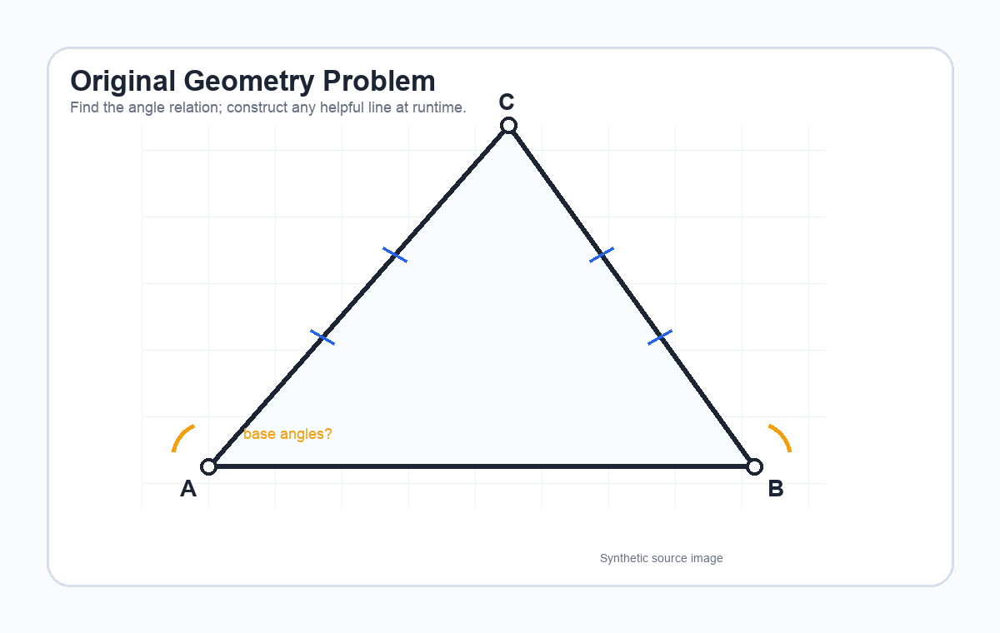

# Geometry Auxiliary-Line Construction

## Description
Dynamic visual skill for geometry problems where the useful step is not a
final diagram, but an intermediate construction: drawing an auxiliary line,
marking equal segments, and keeping angle correspondences visible while the
reasoning proceeds.

## Declarative Textual Logic
- Identify the target geometric relation from the question.
- Locate the stable geometric objects: points, sides, known equalities, angle
  marks, right-angle marks, and requested conclusion.
- Choose the smallest auxiliary construction that exposes a useful relation,
  such as altitude, median, parallel, perpendicular, extension, or connector.
- Render the auxiliary construction and current focus marks onto the task
  image before the next reasoning step.
- Use the rendered overlay as visual working memory; do not rely on hidden
  conversation state for which construction has already been introduced.
- Stop when the construction has made the required relation visually auditable
  or when no supported construction can be justified from the image.

## Dynamic Prior Preview
The images below are synthetic preview assets. They illustrate the overlay
semantics only. At runtime, the dynamic prior must be rendered onto the current
task image.




## Multimodal Binding Protocol
- Task input image: the user's geometry diagram.
- Dynamic overlay image: the same diagram with auxiliary construction and
  current reasoning marks rendered on top.
- Green construction line binds to an accepted auxiliary line.
- Blue segment marks bind to equal or corresponding lengths discovered during
  the run.
- Amber angle rings bind to angle targets or angle correspondences currently
  under discussion.
- Compact focus rings bind to the points or regions that the next step must
  inspect.
- Never copy the synthetic triangle layout, point coordinates, or answer from
  the preview image.

## Runtime Protocol
Iterative dynamic prior. Each round reads the latest overlay, performs one
local geometry decision, updates the visible construction state, and re-renders
onto the original diagram.

State schema:
```json
{
  "round_index": 0,
  "accepted_constructions": [
    {"id": "aux1", "type": "altitude|median|parallel|perpendicular|extension|connector", "points": ["C", "D"], "status": "accepted"}
  ],
  "marked_relations": [
    {"type": "equal_length|equal_angle|right_angle|parallel", "items": ["AD", "DB"], "evidence": "string"}
  ],
  "current_focus": ["point-or-region-id"],
  "stop_reason": ""
}
```

Update rule:
1. Inspect the current diagram and identify the next relation that needs visual
   support.
2. Propose at most one auxiliary construction for this round.
3. Render the construction only if it is justified by visible geometry or by
   the problem statement.
4. Mark newly exposed equal lengths, equal angles, right angles, or parallel
   relations compactly.
5. Re-render the overlay for the next reasoning step.

## Parameters
| Name | Type | Description |
|---|---|---|
| `task_image` | image | Geometry diagram to reason over. |
| `question` | string | Requested geometric relation, proof target, or value. |
| `allowed_constructions` | string | Optional constraint such as altitude only, parallel line only, or no extra construction. |
| `max_rounds` | integer | Maximum construction-and-render rounds. |

## Execution Steps
1. Parse the geometric goal and named points from the question.
2. Ground the diagram's visible points, segments, angle marks, and equality
   marks.
3. Select one helpful auxiliary construction and justify it textually.
4. Render that construction onto the task image with compact visual marks.
5. Inspect the updated overlay and record any exposed equalities or
   correspondences.
6. Repeat only when another construction is necessary and justified.
7. Return the final relation, the construction history, and the latest overlay
   path if available.

## Usage Constraints
- Use this skill only for visible geometry diagrams, not for purely algebraic
  word problems.
- Do not draw unsupported lines just because they would make a proof easier.
- Keep overlay marks thin enough that the original diagram remains readable.
- Do not encode the final answer in the overlay before the reasoning reaches it.
- If the diagram is ambiguous, state the ambiguity instead of inventing hidden
  constraints.

## Output Format
```json
{
  "status": "CONTINUE|DONE|BLOCKED",
  "accepted_constructions": [],
  "marked_relations": [],
  "current_focus": [],
  "answer": "string",
  "rendered_overlay_path": "optional path"
}
```
