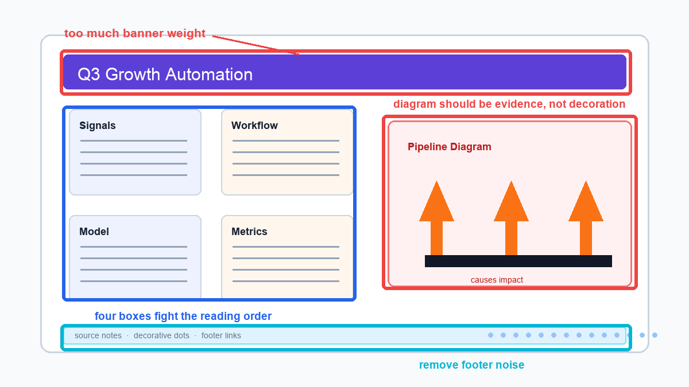
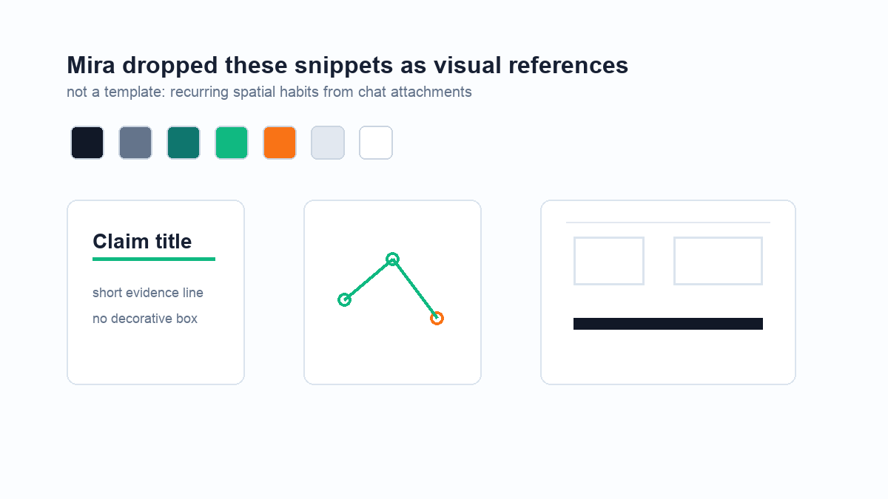

# Minimalist Slide Critique Style

## Description
A visual critique and redesign skill that identifies 'AI-look' slide anti-patterns (heavy banners, fragmented boxes, generic diagrams) and proposes minimalist, whitespace-driven hierarchies based on a specific visual habit.

## Declarative Textual Logic
- **Critique strategy:** Do not start by rewriting copy. First, identify and mark regions that create an 'AI look'.
- **Anti-pattern 1 (Banner Weight):** Avoid heavy, solid-colored title banners that dominate the visual hierarchy.
- **Anti-pattern 2 (Boxed Fragments):** Avoid placing text in multiple isolated cards or boxes that fight the natural reading order.
- **Anti-pattern 3 (Generic Diagrams):** Avoid large, generic decorative shapes (like giant arrows) that do not convey specific data.
- **Anti-pattern 4 (Footer Noise):** Remove decorative dots, unnecessary source notes, and footer links that clutter the bottom edge.
- **Redesign strategy:** Redraw the slide around a single visual argument. Use whitespace and one primary diagram to create hierarchy instead of relying on cards.
- **Typography habit:** Use a 'Claim title' (a strong, concise assertion) followed immediately by a short evidence line, with no decorative bounding box.
- **Diagram habit:** Diagrams should act as evidence (e.g., simple line charts with data points), not decoration.
- **Color habit:** Use a constrained, minimalist palette (dark navy, slate, teal, green, orange, light gray, white) for functional emphasis.

## Visual Priors
*Note: As an interleaved visual skill, the static prior images and their spatial encodings are placed directly within the Execution Steps below to ground each specific critique and redesign phase.*

## Multimodal Binding Protocol
- **Image Roles:** The skill utilizes three visual priors: `anti_pattern_reference`, `hierarchy_comparison`, and `style_snippets`.
- **Coordinate System:** Relative spatial layout.
- **Text-to-Visual Binding:**
  - Bind the concept of 'banner weight' to the top red bounding box in the `anti_pattern_reference`.
  - Bind the concept of 'whitespace-driven hierarchy' to the right side of the `hierarchy_comparison`.
  - Bind the 'Claim title' typography rule to the bottom-left lockup in the `style_snippets`.
  - Bind the 'evidence diagram' rule to the bottom-center line chart in the `style_snippets`.
- **Task Binding Rules:**
  - When reviewing a target slide, compare its layout to the `anti_pattern_reference` to detect similar structural flaws.
  - When suggesting redesigns, apply the spatial habits and color palette from `style_snippets`.
- **Anti-Leakage Rules:**
  - Do not infer personal attributes or present the source person as a biography; focus strictly on the visual design rules extracted from the evidence.
  - Do not treat the snippets as a rigid, unchangeable template; apply them as recurring spatial habits adaptable to new content.

## Runtime Protocol
- **Mode:** Single-turn

## Parameters
| Parameter Name | Type | Description |
|---|---|---|
| `target_slide_image` | image | An image of the draft slide to be critiqued and redesigned. |

## Execution Steps

1. **Identify Anti-Patterns:** Inspect the `target_slide_image` for 'AI-look' anti-patterns: heavy banners, fragmented boxes, generic decorative diagrams, and footer noise, using the annotated prior as a visual reference.

   
   *Spatial Encodings:*
   - **Red outline (top):** Excessive banner weight.
   - **Blue outline (left):** Fragmented boxes fighting reading order.
   - **Red outline (right):** Generic diagram acting as decoration rather than evidence.
   - **Cyan outline (bottom):** Footer noise.

2. **Draft the Critique:** Generate a critique section that explicitly marks or lists the regions in the target slide that violate the minimalist aesthetic.

3. **Formulate Redesign Strategy:** Develop a redesign strategy that removes decorative container boxes and uses whitespace to establish a clear reading order, referencing the hierarchy comparison prior.

   
   *Spatial Encodings:*
   - **Left panel (rejected):** High density of bounding boxes and background fills.
   - **Right panel (approved):** High proportion of whitespace, clear left-aligned typography, absence of container boxes.

4. **Apply Visual Habits:** Detail how to apply the preferred visual habits to the redesign: specify a 'Claim title' lockup, convert generic diagrams into simple evidence-based charts, and apply the constrained color palette from the visual snippets prior.

   
   *Spatial Encodings:*
   - **Top row:** Approved color palette swatches.
   - **Bottom left:** Spatial relationship of 'Claim title' to 'short evidence line'.
   - **Bottom center:** Minimalist line chart style with circular data points.
   - **Bottom right:** Abstract wireframe showing preferred structural alignment.

## Usage Constraints
- The skill must evaluate visual structure and hierarchy, not just text copy.
- Critiques must prioritize structural changes (whitespace, removing boxes) over mere decorative changes.
- Do not output a tutorial schema; output the operational critique and redesign strategy.

## Output Format
A Markdown report containing three sections:
1. **Visual Critique (Anti-Patterns):** A list of identified structural flaws in the target slide.
2. **Hierarchy Redesign Strategy:** A structural plan for replacing boxes with whitespace.
3. **Style Application:** Specific instructions for typography lockups, diagram conversion, and color palette usage.
