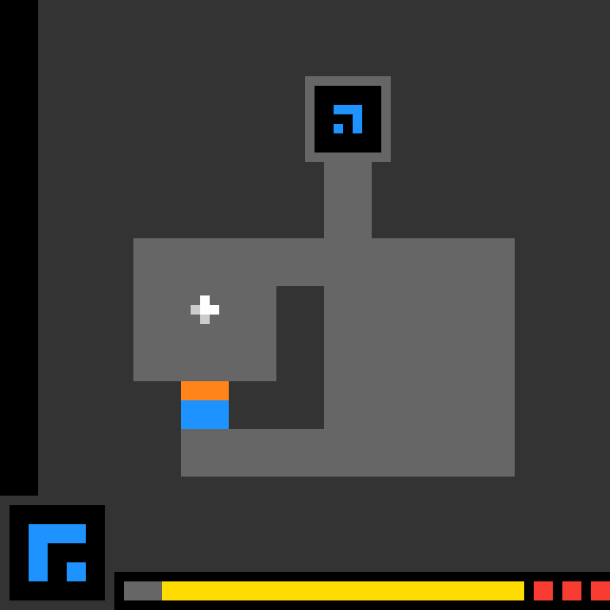
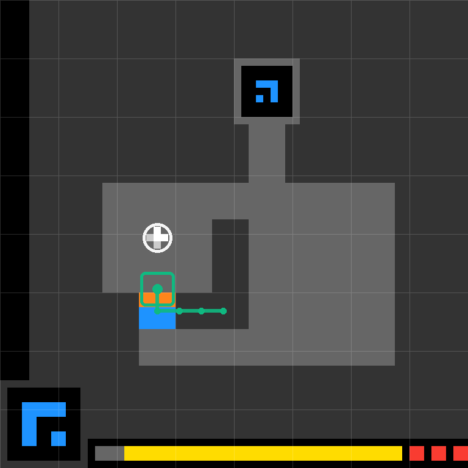

# ARC-AGI Route-State Planning

## Description

A dynamic visual skill for interactive ARC-AGI-3 environments. The skill keeps
the agent's route state visible by rendering the current controllable object,
visited trajectory, next local plan, and waypoint target directly onto the
current game frame.

## Declarative Textual Logic

- Treat each ARC frame as a mutable visual working state, not as a one-shot
  screenshot.
- Identify the controllable object, reachable corridors, obstacles, and visible
  waypoint or target region before choosing the next action.
- After each action, render the updated path and current position back onto the
  latest frame.
- Keep already traversed route segments visible so the next decision does not
  depend only on hidden conversation memory.
- Use thin overlays that preserve the original 64x64 frame; do not cover game
  pixels that the next step must inspect.

## Dynamic Visual References

### Source ARC frame

### Runtime route-state overlay

### Without/with full-route demo

## Visual Encoding

- Green trace: route already taken in the current local plan.
- Green box and dot: current controllable object and action focus.
- White ring: visible waypoint or local target.
- Cyan dashed segment: next local plan from the current state toward the
  waypoint.
- Subtle grid: coordinate support for ARC's 64x64 frame and coordinate actions.

## Runtime Protocol

1. Inspect the latest ARC frame.
2. Locate the controllable object and any visible local target or waypoint.
3. Choose one action from the currently available action set.
4. Execute the action in the ARC environment.
5. Render the route-state overlay onto the returned frame.
6. Feed the overlaid frame into the next model call as visual working memory.
7. Stop when the waypoint is reached, the level is solved, the game ends, or no
   safe action remains.

## Agent Usage

Attach this `skill.md`, `manifest.json`, and the current ARC frame to the model.
For each step, ask the model to update a compact state object containing current
position, chosen action, visited route, target waypoint, and rejected branches.
The runtime renderer should draw that state onto the new ARC frame before the
next action is selected.

## Failure Modes

- Drawing a route on a stale frame after the environment has changed.
- Hiding narrow corridors or targets with opaque overlays.
- Treating the preview coordinates as a template for other ARC games.
- Letting the textual action history replace the visible route overlay.
