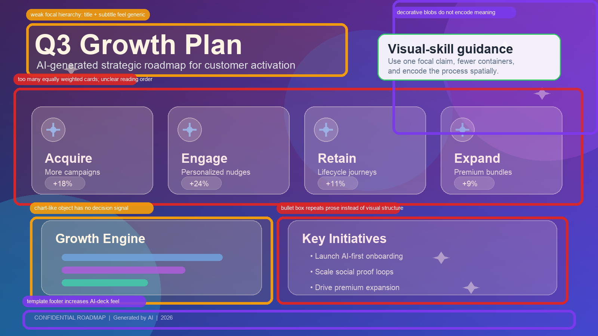
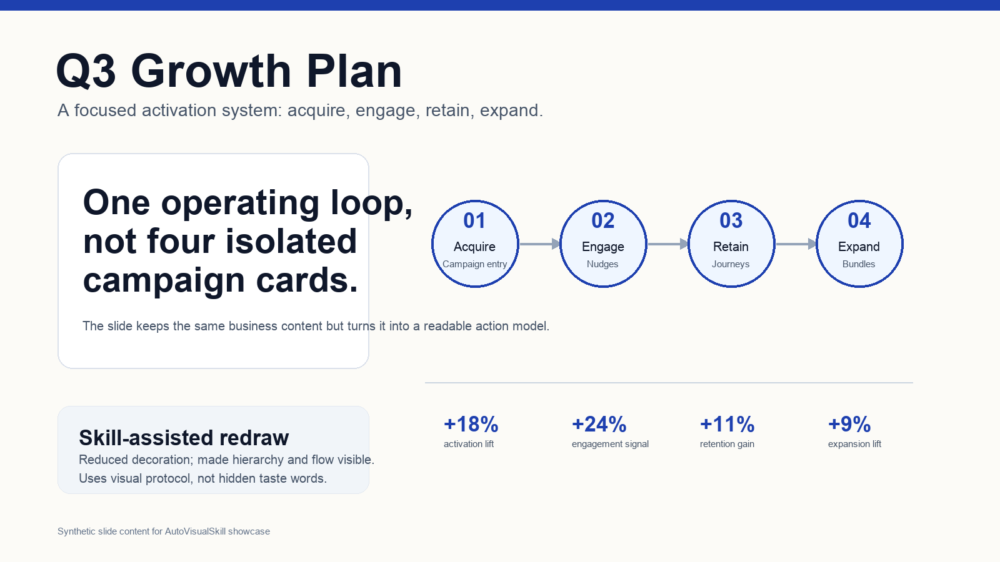
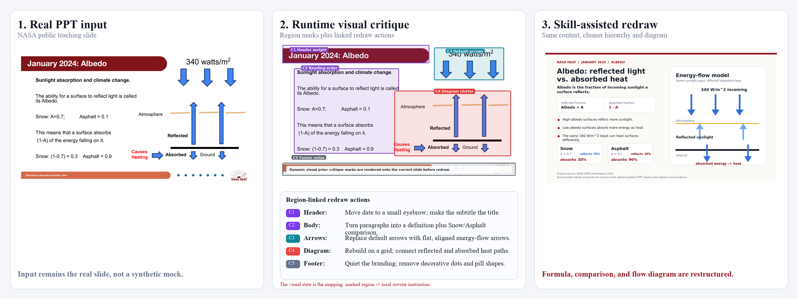

# Presentation Design Critique-and-Redraw

## Description
Dynamic visual skill for slide-making agents. It reduces generic
AI-generated PPT styling by rendering visual critique directly onto a draft
slide, then using that visible critique state to guide a cleaner redraw.

This skill does not claim universal taste. It demonstrates one reusable
professional slide protocol: fewer containers, clearer hierarchy, restrained
decoration, visible reading order, and design choices tied to the slide's
message.

## Declarative Textual Logic
- Preserve the user's core slide content and business message.
- Inspect the draft as an image, not only as a list of text blocks.
- Identify visual problems that text-only rules often miss: weak focal point,
  too many equally weighted elements, crowded spacing, decorative gradients,
  inconsistent icon language, unclear reading order, and template-like footer
  noise.
- Render those issues as compact critique marks on the draft slide.
- Use the critique overlay as visual working memory for the redraw.
- Redraw the slide by changing composition, hierarchy, spacing, and visual
  encodings while preserving the content.
- Stop when the redraw has a single readable focal claim, clear supporting
  evidence, and less generic AI-deck styling.

## Dynamic Prior Preview
The images below are synthetic preview assets. They illustrate source draft,
critique overlay, and redraw components only. At runtime, the dynamic prior
must be rendered onto the current draft slide.






## Recorded Runtime Critique Trace
The trace below applies the generated dynamic visual skill to a real public
NASA HEAT teaching slide. The middle panel is the key runtime state: critique
regions are rendered directly on the slide and linked to local redraw actions
before the final redraw.



## Multimodal Binding Protocol
- Draft slide image: the current slide produced by a text-only or first-pass
  generation agent.
- Dynamic critique overlay: the same slide with visible issue regions and
  compact critique labels.
- Style reference board: reusable visual constraints for the target
  professional slide style.
- Red outline binds to structural critique such as equal-weight cards,
  clutter, or unclear reading order.
- Amber outline binds to hierarchy or evidence problems.
- Purple outline binds to generic decorative AI styling.
- Green guidance box binds to actionable redraw guidance for the next pass.
- Never copy the synthetic slide topic, metrics, or layout as user-specific
  content.

## Runtime Protocol
Iterative dynamic prior. Each round inspects the current draft, renders a
critique overlay, redraws or revises the slide, and optionally repeats if
major visual issues remain.

State schema:
```json
{
  "round_index": 0,
  "draft_slide_path": "string",
  "critique_regions": [
    {
      "id": "region_1",
      "bbox": [0, 0, 0, 0],
      "issue_type": "weak_focal_point|clutter|generic_decoration|spacing|reading_order|icon_language",
      "severity": "low|medium|high",
      "redraw_instruction": "string"
    }
  ],
  "style_targets": ["single focal claim", "clear grouping", "restrained palette"],
  "redraw_status": "needs_redraw|improved|blocked"
}
```

Update rule:
1. Inspect the draft slide image.
2. Mark the most important visual issues directly on the slide.
3. Convert each marked issue into one redraw instruction.
4. Produce or request a revised slide that follows the visible critique.
5. Re-inspect the revised slide if another round is needed.

## Parameters
| Name | Type | Description |
|---|---|---|
| `draft_slide` | image | Draft slide to critique and redraw. |
| `slide_goal` | string | Message, audience, and content that must be preserved. |
| `style_reference` | image | Optional visual reference board or style constraints. |
| `max_rounds` | integer | Maximum critique-and-redraw rounds. |

## Execution Steps
1. Read the slide goal and identify content that must be preserved.
2. Inspect the draft slide as a visual composition.
3. Render critique marks for hierarchy, clutter, spacing, decoration, reading
   order, and icon/shape consistency.
4. Convert critique marks into a redraw plan.
5. Produce the cleaner redraw with fewer containers, clearer focal hierarchy,
   and restrained visual style.
6. Return the critique overlay, redraw summary, and final slide path if
   available.

## Usage Constraints
- Use this skill for slide design, pitch decks, internal presentations, and
  visual communication drafts.
- Do not use it to invent unsupported business content or metrics.
- Do not treat the style reference as a universal aesthetic rule; it is one
  reusable professional PPT style.
- Keep critique labels compact and local so the draft remains readable.
- Do not hide the original slide under opaque marks.
- Do not remove required content while improving visual hierarchy.

## Output Format
```json
{
  "status": "CONTINUE|DONE|BLOCKED",
  "critique_regions": [],
  "redraw_instructions": [],
  "preserved_content": [],
  "style_changes": [],
  "critique_overlay_path": "optional path",
  "redraw_slide_path": "optional path"
}
```
